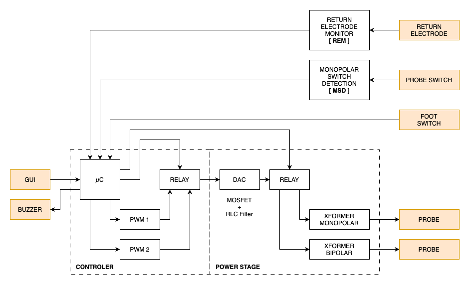
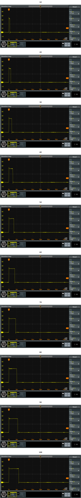
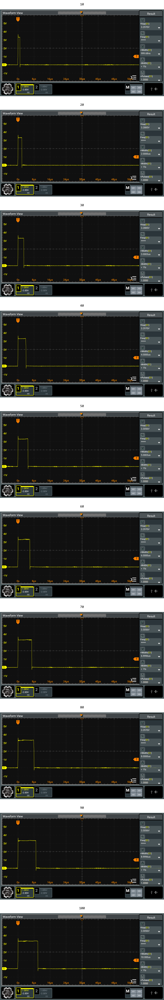

# I. General Concept
<p align="center">
  
</p>

# II. Component
## 1. Monopolar Switch Detection (MSD)
### a. Schematic

<p align="center">
  
</p>

### b. Output Scope
- Cut
- Coag
## 2. Return Electrode Monitor (REM)
### a. Schematic

<p align="center">
  
</p>

### b. Output Scope
#### Transformer
Below is the output scope at the input and output of toroidal transformer.

<p align="center">
  
</p>

#### Sense
> [!NOTE]
> All measurements for Return Electrode Monitoring do not utilize a physical Return Electrode; instead, a variable resistor is used. Therefore, all references to **pad resistance** in this context describe the variable resistor that simulates the Return Electrode.

Below is the output scope from the sense circuit, where the pad resistance values are 5Ω, 200Ω, 1kΩ, and High Impedance. The voltages measured by the oscilloscope are 10.385 mV, 558.91 mV, 689.31 mV, and 1.1164 V, respectively.

<p align="center">
  
</p>

The ESP32's ADC provides a versatile and powerful way to read analog signals with a resolution of up to 12 bits and operates with a reference voltage of 0V to 3.3V (the default voltage range). Below is the formula to calculate the voltage per level for the ADC at 12-bit resolution.
<br>

```math
Voltage \, per \, Level = \frac{Voltage \, Range}{2^{Resolution}} = \frac{3.3V - 0V}{2^{12}} = \frac{3.3V}{4096} ≈ 0.00080586V ≈ 0.80586 mV
```
<br>
Below is the formula to calculate the ADC value based on the voltage sense and the Voltage per Level.
<br>
<br>

```math
ADC \, Value = \frac{Vsense}{Voltage \, per \, Level}
```
<br>
Using the formula above, we have the following ADC values for different pad resistances:

<div align="center">

| Pad Resistance | Measured Voltage | ADC Value |
| -------------: | ---------------: | --------: |
|             5Ω |        10.385 mV |        19 |
|           200Ω |        558.91 mV |       694 |
|            1kΩ |        689.31 mV |       855 |
|         High-Z |        1116.4 mV |      1385 |

</div>

## 3. Controller
### a. PWM Generator
#### Using the Remote Control Module (RMT) of ESP32 for Generating PWM Signals
The Remote Control Module (RMT) on the ESP32 is a versatile hardware peripheral designed primarily for sending and receiving infrared signals. However, it can also be effectively utilized to generate precise Pulse Width Modulation (PWM) signals.
#### Key Concepts
- Duty Cycle:<br>The duty cycle of a PWM signal is the percentage of one cycle in which the signal is high (on) versus low (off). It is typically expressed as a value between 0 and 100.
- Total Period:<br>The total period of the PWM signal is the sum of the HIGH time and LOW time.
#### Configuration
##### Clock Divider
The clock divider is a crucial parameter in microcontroller and digital circuit design that determines the frequency of a clock signal by dividing the input clock frequency, which is APB_CLK (80 MHz) for ESP32.

```math
Clock \, Divider = \frac{APB \_ CLK}{Clock \, Frequency}
```

##### Resolution
The resolution in duty cycle is a crucial parameter in microcontroller and digital circuit design that determines the granularity of control over the PWM signal. It defines how finely the duty cycle can be adjusted, allowing for precise modulation of the output signal. In the case of the ESP32, the resolution is influenced by the clock frequency which ultimately affect the ability to achieve desired output levels.

```math
Resolution = \frac{Clock \, Frequency}{PWM \, Frequency}
```

##### Combination of Clock Frequency and Resolution
The combination of clock frequency and resolution plays a vital role in determining the performance of PWM signals in microcontroller applications. The clock frequency sets the base rate at which the system operates, while the resolution defines how many discrete levels the duty cycle can be divided into. A higher clock frequency allows for faster switching and more precise timing, while a higher resolution enables finer control over the duty cycle. Together, they influence the accuracy and responsiveness of the PWM output, making it essential to balance these parameters to meet the specific requirements of the application.

<div align="center">

| Mode          | f PWM    | f Clock  | Clock Div | Resolution | 
| ------------- | -------: | -------: | --------: | ---------: |
| Pure Cut      |  400 kHz |   80 MHz |         1 |        200 |
| Blend Cut 1   |  400 kHz |   80 MHz |         1 |        200 |
| Blend Cut 2   |  400 kHz |   80 MHz |         1 |        200 |
| Coag Spray    |   25 kHz |   10 MHz |         8 |        400 |
| Coag Forced   |   20 kHz |   10 MHz |         8 |        500 |
| Coag Standard |  400 kHz |   80 MHz |         1 |        200 |

</div>

#### Output Scope
##### Cut
- Pure Cut
<br>The image illustrates the output scope for the Pure Cut operation at the PWM generator. It provides a detailed view of the waveform characteristics and performance metrics associated with the Pure Cut process, highlighting the key features and behavior of the PWM signal during this operation.
<br>For duty cycle levels ranging from 10 to 100, demonstrates similar PWM frequency, indicating consistent performance across these duty cycle settings.

> [!NOTE]
> Pure Cut PWM signal utilize a discrete resolution of 200 levels. Therefore, all references to **duty cycle** in this context should be understood as discrete levels rather than percentages.

<p align="center">
  
</p>


- Blend Cut 1 & Blend Cut 2
<br>The image illustrates the output scope for the Blend Cut 1 (left) and Blend Cut 2 (right ) operation at the PWM generator. It provides a detailed view of the waveform characteristics and performance metrics associated with the Blend Cut process, highlighting the key features and behavior of the PWM signal during this operation.

  - In the images of Blend Cut 1 and Blend Cut 2, both exhibit the same PWM frequency of 400 kHz.
  - Additionally, for duty cycle levels ranging from 10 to 100, Blend Cut 1 and Blend Cut 2 demonstrate similar waveform HIHGH state periods, indicating consistent performance across these duty cycle settings.
  - Furthermore, each pulse in both Blend Cut 1 and Blend Cut 2 is similar to a single pulse of a Pure Cut PWM signal.

> [!NOTE]
> Blend cut 1: 18 pulses per 1 modulation (400 kHz for each pulse, with 0% PWM during the last 2 periods).<br>Blend cut 2: 17 pulses per 1 modulation (400 kHz for each pulse, with 0% PWM during the last 3 periods).<br>Both Blend Cut 1 and Blend Cut 2 utilize a discrete resolution of 200 levels, similar to that of a Pure Cut PWM signal. Therefore, all references to **duty cycle** in this context should be understood as discrete levels rather than percentages.

<p align="center">
  
</p>

##### Coag
- Spray
<br>The image illustrates the output scope for the Spray Coagulation operation at the PWM generator. It provides a detailed view of the waveform characteristics and performance metrics associated with the Spray Coagulation process, highlighting the key features and behavior of the PWM signal during this operation.
<br>For duty cycle levels ranging from 10 to 100, demonstrates similar PWM frequency, indicating consistent performance across these duty cycle settings. We can observe that the increment of the duty cycle results in a pulse that exhibits a linear increase in HIGH time, further emphasizing the effectiveness of the PWM modulation in maintaining a predictable response across varying duty cycle levels.

<div align="center">

| Duty Cycle |       % | HIGH Time |
| ----------:| ------: | ---------:|
|         10 |   2.5 % |      1 us |
|         20 |   5.0 % |      2 us |
|         30 |   7.5 % |      3 us |
|         40 |  10.0 % |      4 us |
|         50 |  12.5 % |      5 us |
|         60 |  15.0 % |      6 us |
|         70 |  17.5 % |      7 us |
|         80 |  20.0 % |      8 us |
|         90 |  22.5 % |      9 us |
|        100 |  25.0 % |     10 us |
|        ... |     ... |       ... |
|        200 |  50.0 % |     20 us |
|        300 |  75.0 % |     30 us |
|        400 | 100.0 % |     40 us |

</div>

> [!NOTE]
> Spray Coagulation PWM signal utilize a discrete resolution of 400 levels. Therefore, all references to **duty cycle** in this context should be understood as discrete levels rather than percentages.

<p align="center">
  
</p>

- Forced
<br>The image illustrates the output scope for the Forced Coagulation operation at the PWM generator. It provides a detailed view of the waveform characteristics and performance metrics associated with the Forced Coagulation process, highlighting the key features and behavior of the PWM signal during this operation.
<br>For duty cycle levels ranging from 10 to 100, demonstrates similar PWM frequency, indicating consistent performance across these duty cycle settings. We can observe that the increment of the duty cycle results in a pulse that exhibits a linear increase in HIGH time, further emphasizing the effectiveness of the PWM modulation in maintaining a predictable response across varying duty cycle levels.

> [!NOTE]
> Forced Coagulation PWM signal utilize a discrete resolution of 500 levels. Therefore, all references to **duty cycle** in this context should be understood as discrete levels rather than percentages.

<div align="center">

| Duty Cycle |       % | HIGH Time |
| ----------:| -------:| ---------:|
|         10 |   2.0 % |      1 us |
|         20 |   4.0 % |      2 us |
|         30 |   6.0 % |      3 us |
|         40 |   8.0 % |      4 us |
|         50 |  10.0 % |      5 us |
|         60 |  12.0 % |      6 us |
|         70 |  14.0 % |      7 us |
|         80 |  16.0 % |      8 us |
|         90 |  18.0 % |      9 us |
|        100 |  20.0 % |     10 us |
|        ... |     ... |       ... |
|        200 |  40.0 % |     20 us |
|        300 |  60.0 % |     30 us |
|        400 |  80.0 % |     40 us |
|        500 | 100.0 % |     50 us |

</div>

<p align="center">
  
</p>


- Standard

### b. Serial Communication
#### 1 Parameters <[command]>
| Command |	Description 	            | Example | Success Response  | Error Response  |
| -------:|:------------------------- |:------- |:-----------------:|:---------------:|
|       2 | Stop all RMT transmission |	2	      | 00                | N/A             |
| Other   | Invalid command           | 3       | N/A               | 02              |

#### 2 Parameters <[command] [mode]>
##### command = 0
| Mode  |	Auto-assigned Channel | Description       | Example |	Success Response  |	Error Response  |
| -----:|:---------------------:|:----------------- |:------- |:-----------------:|:---------------:|
|     0 |	Channel 0             |	Pure cut          | 0 0     |	00	              | N/A             |
|     1 |	Channel 0             |	Cut pattern 1     | 0 1     |	00	              | N/A             |
|     2 |	Channel 0             |	Cut pattern 2     | 0 2     |	00	              | N/A             |
|     3 |	Channel 1             |	Coag Spray        | 0 3     |	00	              | N/A             |
|     4 |	Channel 1             |	Coag Forced       | 0 4     |	00	              | N/A             |
|     5 |	Channel 1             |	Bipolar Standard  | 0 5     |	00	              | N/A             |
| Other |	N/A	                  | Invalid           | 0 6     | N/A	              | 02              |

#### 3 Parameters <[command] [mode] [duty cycle]>
##### command = 1
| Mode  |	Duty Cycle  |	Description         |	Example |	Success Response  |	Error Response  |
| -----:|:-----------:|:------------------- |:------- |:-----------------:|:---------------:|
|     0 |	    0 - 200 |	Pure cut            |	1 0 100 |	00	              | 02              |
|     1 |	    0 - 200 |	Cut pattern 1       |	1 1 150 |	00	              | 02              |
|     2 |	    0 - 200 |	Cut pattern 2       |	1 2 120 |	00	              | 02              |
|     3 |	    0 - 400 |	Coag Spray          |	1 3 250 |	00	              | 02              |
|     4 |	    0 - 500 |	Coag Forced         |	1 4 300 |	00	              | 02              |
|     5 |	    0 - 200 |	Bipolar Standard    |	1 5 80  |	00	              | 02              |
| Other |	        N/A	| Invalid	            | 1 6 100 |	N/A	              | 02              |

## 4. Power Stage
### a. DAC
#### Schematic

<p align="center">
  
</p>

##### MOSFET Driver
We use the TC4420 as our MOSFET driver due to its high-speed performance and ability to efficiently drive N-channel MOSFETs in various applications. The TC4420 provides a peak output current of up to 6A, allowing for rapid charging and discharging of the MOSFET gate capacitance. This capability minimizes switching losses and enhances overall efficiency in power management.

Operating within a supply voltage range of 4.5V to 18V, the TC4420 can effectively drive MOSFET gates at a voltage level of 12V, ensuring that the MOSFET turns on fully for optimal performance. Its fast switching speed, with propagation delays in the nanosecond range (typically 55ns), is crucial for high-frequency applications, reducing transition times and heat generation.

##### Utilizing Three IRFPE50 MOSFETs in Parallel for Enhanced Performance and Reliability
We use three IRFPE50 MOSFETs in parallel to enhance the overall performance and reliability of our circuit. The decision to parallel these MOSFETs is driven by several key factors:
- Increased Current Handling:<br>Each IRFPE50 MOSFET has a maximum continuous drain current rating of ID=7.8A at TC=25°C and ID=4.9A at TC=100°C. By connecting three times as many of them in parallel, we effectively triple the total current handling capability. This is particularly beneficial in applications where high current loads are expected, ensuring that the circuit can handle the demands without overheating or exceeding the MOSFET's ratings.
- Improved Thermal Management:<br>Paralleling MOSFETs helps distribute the heat generated during operation across multiple devices. This reduces the thermal stress on each individual MOSFET, allowing for better thermal management. Proper heat dissipation is crucial for maintaining performance and preventing thermal runaway, especially in high-power applications.
- Lower On-Resistance:<br>The IRFPE50 has a low on-resistance (RDS(on)) of approximately 1.2Ω. When MOSFETs are paralleled, the effective on-resistance decreases, which results in lower conduction losses. This is advantageous for improving the efficiency of the circuit, as it minimizes the voltage drop across the MOSFETs when they are in the on state.
- Redundancy and Reliability:<br>Using multiple MOSFETs in parallel provides a level of redundancy. If one MOSFET were to fail, the remaining devices can continue to operate, thereby enhancing the overall reliability of the circuit. This is particularly important in critical applications where failure could lead to significant issues.

#### Output Scope
##### Cut
The image illustrates the output scope for the Pure Cut operation at:
- MOSFET Driver Output (blue)
- MOSFET Drain Pin (yellow)
- VDS=12V

It provides a detailed view of the waveform characteristics and performance metrics associated with the Pure Cut process, highlighting the key features and behavior of the DAC signal during this operation.
<br>For duty cycle levels ranging from 20 to 180, demonstrates similar Waveform frequency, indicating consistent performance across these duty cycle settings.

> [!NOTE]
> Pure Cut PWM signal utilize a discrete resolution of 200 levels. Therefore, all references to **duty cycle** in this context should be understood as discrete levels rather than percentages.

<p align="center">
  
</p>

##### Coag
### b. Transformer
#### Monopolar
##### Design and Calculation
Air Core Transformer using Cylindrical Bobbin

**Bobbin Specifications:**
- Diameter: 14 mm
- Height: 19 mm
- Operating Frequency: 400 kHz PWM

**Design Parameters:**
Assuming similar power requirements as bipolar design:
- $V_{in} = 72 \ V$
- $V_{out} = 216 \ V$ (3:1 ratio)
- $f = 400 \ kHz = 400,000 \ Hz$
- $P_{out} = 100 \ W$ (target power)

**Air Core Inductance Calculation:**
For a single-layer cylindrical coil:

$L = \frac{\mu_0 \cdot N^2 \cdot A}{l}$

Where:
- $\mu_0 = 4\pi \times 10^{-7} \ H/m$ (permeability of free space)
- $N$ = number of turns
- $A$ = cross-sectional area = $\pi \times (d/2)^2 = \pi \times (14/2)^2 = 153.94 \ mm^2$
- $l$ = coil length (height) = 19 mm

**Turn Calculation for Air Core:**
For air core transformers at high frequency, we use:

$N_p = \frac{V_{in} \times 10^8}{4.44 \times f \times B_{max} \times A_{eff}}$

For air core: $B_{max} \approx 0.1 \ T$ (much lower than ferrite)
$A_{eff} = 153.94 \ mm^2 = 1.5394 \times 10^{-4} \ m^2$

$N_p = \frac{72 \times 10^8}{4.44 \times 400,000 \times 0.1 \times 1.5394 \times 10^{-4}} = \frac{7.2 \times 10^9}{27.3} = 264 \ turns$

**Turns Ratio:**
$N_s = N_p \times \frac{V_{out}}{V_{in}} = 264 \times \frac{216}{72} = 264 \times 3 = 792 \ turns$

**Wire Specifications:**
At 400 kHz, skin depth = 0.105 mm

Primary Current: $I_p = \frac{P}{V_{in}} = \frac{100}{72} = 1.39 \ A$
Secondary Current: $I_s = \frac{P}{V_{out}} = \frac{100}{216} = 0.46 \ A$

**Wire Diameter Calculation:**
Using current density of 2 A/mm² for air core:

Primary: $d_p = \sqrt{\frac{4 \times I_p}{\pi \times J}} = \sqrt{\frac{4 \times 1.39}{\pi \times 2}} = 0.94 \ mm$

Secondary: $d_s = \sqrt{\frac{4 \times I_s}{\pi \times J}} = \sqrt{\frac{4 \times 0.46}{\pi \times 2}} = 0.54 \ mm$

**High-Frequency Wire Selection:**
- **Primary**: 7 × AWG 30 parallel (0.255 mm each) or 105/44 Litz wire
- **Secondary**: 3 × AWG 32 parallel (0.202 mm each) or 50/46 Litz wire

**Winding Configuration:**
- **Primary**: 264 turns, inner layer
- **Secondary**: 792 turns, outer layer
- **Layer separation**: Kapton tape insulation

**Wire Length Calculation:**
Mean turn length ≈ π × diameter = π × 14 = 43.98 mm

Primary wire length: 264 × 43.98 = 11.61 m (+ 20% leads) = **13.9 m**
Secondary wire length: 792 × 43.98 = 34.83 m (+ 20% leads) = **41.8 m**

**Winding Layers:**
With wire diameter ~0.3 mm (including insulation):
- Primary layers: 264 turns ÷ (19mm ÷ 0.3mm) ≈ 4 layers
- Secondary layers: 792 turns ÷ (19mm ÷ 0.3mm) ≈ 12 layers
- Total bobbin utilization: ~16 layers × 0.3mm = 4.8 mm radial thickness

**Expected Performance:**
- **Coupling coefficient**: ~0.7-0.8 (air core)
- **Leakage inductance**: Higher than ferrite core
- **Efficiency**: 85-90% (due to air core losses)
- **Bandwidth**: Excellent for 400 kHz PWM
#### Bipolar
##### Design and Calculation
Toroidal Ferrite Core Transformer

$V_{in} = 72 \ V$

$V_{out} = 216 \ V$

$f = 400 \ kHz = 400,000 \ Hz$

- $ID = 23.3 \ mm$
- $OD = 40.4 \ mm$
- $H = 15.1 \ mm$

$A_e = \frac{( OD – ID ) • H }{ 2 }$

$A_e  = \frac{( 40.4 – 23.3 ) • 15.1 }{ 2 } = 129.1 \ mm^2$

$B_{max} = 350 \ Gauss$

$N_p = \frac{ V_{in} • Duty \ Cycle • 10^{10} }{ 2 • f • B_{max} • A_e }$

$N_p = \frac{ 72 • 0.5 • 10^{10} }{ 2 • 400,000 • 350 • 129.1 } = \frac{ 360,000,000,000 }{ 36,149,400,000 }$

$N_p = 9.96 ≈ 10 \ turns$

$Volt \ per \ turn = \frac{ V_{in} }{ N_p }$

$Volt \ per \ turn = \frac{ 72 }{ 10 } = 7.2 \ V/turn$

$N_s = \frac{ V_{out} }{ Volt \ per \ turn }$

$N_s = \frac{ 216 }{ 7.2 } = 30 \text{ turns}$

$I_{out} = 0.5 \ A$

$P = V_{out} • I_{out} = 216 • 0.5 = 108 \ W$

$I_{in} = \frac{ P }{ V_{in} } = \frac{ 108 }{ 72 } = 1.5 \ A$

For high-frequency applications (400 kHz), we need to consider:
- **Skin effect** - Current tends to flow on the surface of conductors at high frequencies
- **Current density** - Typically 1.5-3 A/mm² for transformer applications
- **Temperature rise** - Higher current density = more heat

###### Wire Diameter
$dW_p = \sqrt{ \frac{ 4 • I }{ \pi • Current \ Density } }$

- Primary
$I_{in} = 1.5 \ A$

$Current \ Density = 1.5 \ A/mm^2$

$dW_p = \sqrt{ \frac{ 4 • 1.5 }{ 3.14 • 1.5 } } = \sqrt{ \frac{ 6 }{ 4.712 } } = 1.13 \ mm$

- Secondary
$I_{out} = 0.5 \ A$

$Current \ Density = 1.5 \ A/mm^2$

$dW_s = \sqrt{ \frac{ 4 • 0.5 }{ 3.14 • 1.5 } } = \sqrt{ \frac{ 2 }{ 4.712 } } = 0.65 \ mm$

###### High-Frequency Considerations
At 400 kHz, the skin depth in copper is approximately:

$Skin \ depth = \sqrt{ ρ/(π × f × μ) } ≈ 0.1 \ mm$

Since our calculated wire diameters are larger than 2× skin depth, consider using:
1. **Litz wire** for better high-frequency performance
2. **Multiple parallel smaller wires** instead of single thick wire
3. **Stranded wire** with individual strand diameter < 0.2 mm

###### Wire Specification for 400 kHz Operation using Stranded wire
- Primary
  - 7 parallel 0.2 mm each
  - Total current capacity: ~2.1A
  - Total equivalent area: ~1.5 mm²
- Secondary
  - 4 parallel 0.2 mm each
  - Total current capacity: ~1.0A
  - Total equivalent area: ~0.8 mm²

###### Wire Length Calculation
$Length \ per \ turn = 2 • (\frac{OD - ID}{2} + H)$

$Length \ per \ turn = 2 • (\frac{40.4 - 23.3}{2} + 15.1 ) = 47.3 \ mm$

- Primary
  - Number of Wire: 7
  - Turns: 10
  - $Individual \ Length = 10 • 47.3 • 1.1 ≈ 520 \text{ mm including 10\% leads} $
  - $Total \ Length = 7 • 520 = 3640 \ mm = 3.64 \ m$
- Secondary
  - Number of Wire: 4
  - Turns: 30
  - $Individual \ Length = 30 • 47.3 • 1.1 ≈ 1561 \text{ mm including 10\% leads}$
  - $Total \ Length = 4 • 1561 = 6244 \ mm = 6.24 \ m$

$Total \ Wire \ Length \ Needed = 3.64 + 6.24 = 9.88 m$

##### Output Scope
The image illustrates the output scope for per pulse operation at input transformer with VDS=12V and PWM frequency 400kHz
<br>For duty cycle levels ranging from 10 to 100, demonstrates similar Waveform length, indicating consistent performance across these duty cycle settings.

> [!NOTE]
> 400kHz PWM signal utilize a discrete resolution of 200 levels. Therefore, all references to **duty cycle** in this context should be understood as discrete levels rather than percentages.

<p align="center">
  
</p>

### c. LC Filter
#### Monopolar
##### Design and Calculation
EE Ferrite Core Inductor
#### Bipolar
##### Design and Calculation
<p align="center">
  
</p>

Cut-off Frequency for single-ended LC Filter<br><br>
$f_0 = \frac{ ⍵_0 }{ 2 • π } = \frac{ 1 }{ 2 • π • \sqrt{ L_{BTL} • C_L } }$

Quality Factor<br><br>
$Q = R_L • \sqrt{ \frac{ C_L }{ L_{BTL} } } $

To design a filter that is critically damped with a Butterworth response, Q = 0.707 = 1/√2. By substituting Q = 1/√2 into equations for Cut-off Frequency and Quality Factor previously listed, L and C values can be derived for a critically damped system assuming the desired cut-off frequency, ωo, is known.

From<br><br>
$Q = R_L • \sqrt{ \frac{ C_L }{ L_{BTL} } } = \frac{ 1 }{ \sqrt{ 2 } } $

Rearanging<br><br>
$\sqrt{ \frac{ C_L }{ L_{BTL} } } = \frac{ 1 }{ R_L • \sqrt{ 2 } } → \frac{ C_L }{ L_{BTL} } = \frac{ 1 }{ R_L^2 • 2 }$

$C_L = \frac{ L_{BTL} }{ R_L^2 • 2 }$

Subtituting into equation for Cut-off Frequency.<br><br>
$f_0 = \frac{ 1 }{ 2 • π • \sqrt{ L_{BTL} • \frac{ L_{BTL} }{ R_L^2 • 2 } } }$

$f_0 = \frac{ 1 }{ 2 • π • \sqrt{ \frac{ L_{BTL}^2 }{ R_L^2 • 2 } } }$

$f_0 = \frac{ 1 }{ 2 • π • \frac{ L_{BTL} }{ R_L • \sqrt{ 2 } } }$

$f_0 = \frac{ R_L • \sqrt{ 2 } }{ 2 • π • L_{BTL} }$

Solving for L and C<br><br>
$L_{BTL} = \frac{ R_L • \sqrt{ 2 } }{ 2 • π • f_0 }$

$C_L = \frac{ 1 }{ 2 • π • f_0 • R_L • \sqrt{ 2 } }$

Calculate for
- $R_{BTL} = 100Ω$
- $f_0 = 400 \text{ kHz} = 400,000 \text{ Hz}$

where
- $C_{BTL} = \frac{ C_L }{ 2 }$
- $R_L = \frac{ R_{BTL} }{ 2 }$

then<br><br>
$L_{BTL} = \frac{ \frac{ R_{BTL} }{ 2 } • \sqrt{ 2 } }{ 2 • π • f_0 } = \frac{ \frac{ 100 }{ 2 } • \sqrt{ 2 } }{ 2 • 3.14 • 400,000 } = \frac{ 70.7106 }{ 2,512,000 } = 0.000028149155 \ H$

$L_{BTL} = 28.1492 \ µH ≈ 29 \ µH$


$C_{BTL} = \frac{ \frac{ 1 }{ 2 • π • f_0 • \frac{ R_{BTL} }{ 2 } • \sqrt{ 2 } } }{ 2 } = \frac{ \frac{ 1 }{ 2 • 3.14 • 400,000 • \frac{ 100 }{ 2 } • \sqrt{ 2 } } }{ 2 } = \frac{ \frac{ 1 }{ 2,512,000 • 70.7106 } }{ 2 } = 0.000000000281492 \ F$

$C_{BTL} = 2.81492 \ nF ≈ 2.7 \ nF$

<!-- Air Core Axial Inductor
| N1  | N2  |
|----:|----:|
|  36 | 144 |
|  36 | 144 | -->
##### Design and Calculation
Rectangullar Air Core Inductor