# 1. General Concept
<p align="center">
  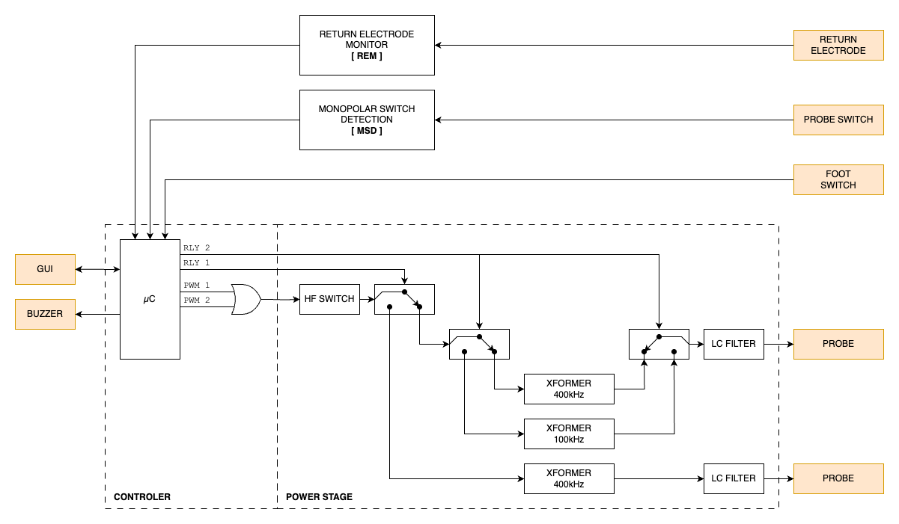
</p>

<p align="center">
  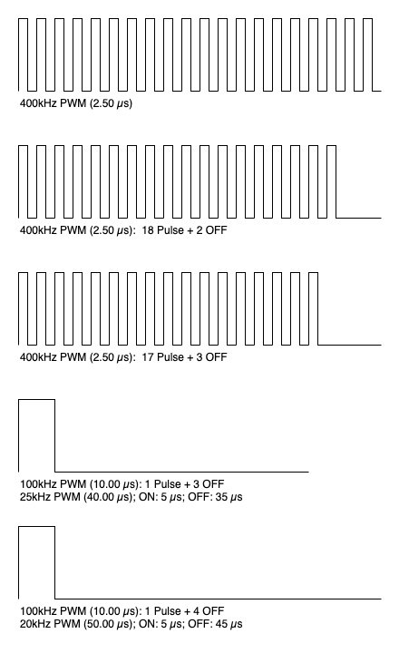
</p>

# 2. Component
## 2.1. Monopolar Switch Detection (MSD)
### 2.1.1. Schematic

<p align="center">
  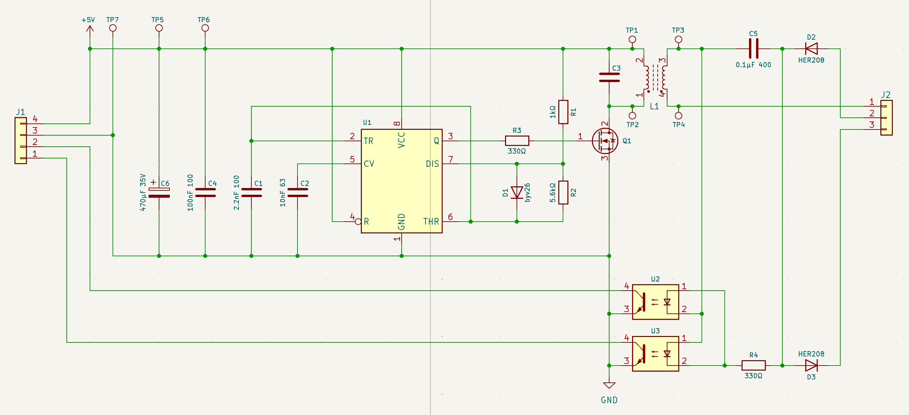
</p>

### 2.1.2. Output Scope
- Cut
- Coag

## 2.2. Return Electrode Monitor (REM)
### 2.2.1. Schematic

<p align="center">
  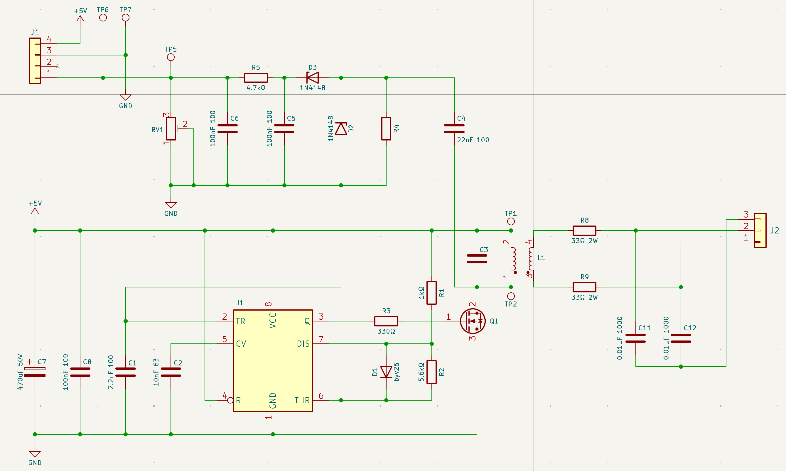
</p>

### 2.2.2. Output Scope
#### 2.2.2.1. Transformer
Below is the output scope at the input and output of toroidal transformer.

<p align="center">
  
</p>

#### 2.2.2.2 Sense
> [!NOTE]
> All measurements for Return Electrode Monitoring do not utilize a physical Return Electrode; instead, a variable resistor is used. Therefore, all references to **pad resistance** in this context describe the variable resistor that simulates the Return Electrode.

Below is the output scope from the sense circuit, where the pad resistance values are 5Ω, 200Ω, 1kΩ, and High Impedance. The voltages measured by the oscilloscope are 10.385 mV, 558.91 mV, 689.31 mV, and 1.1164 V, respectively.

<p align="center">
  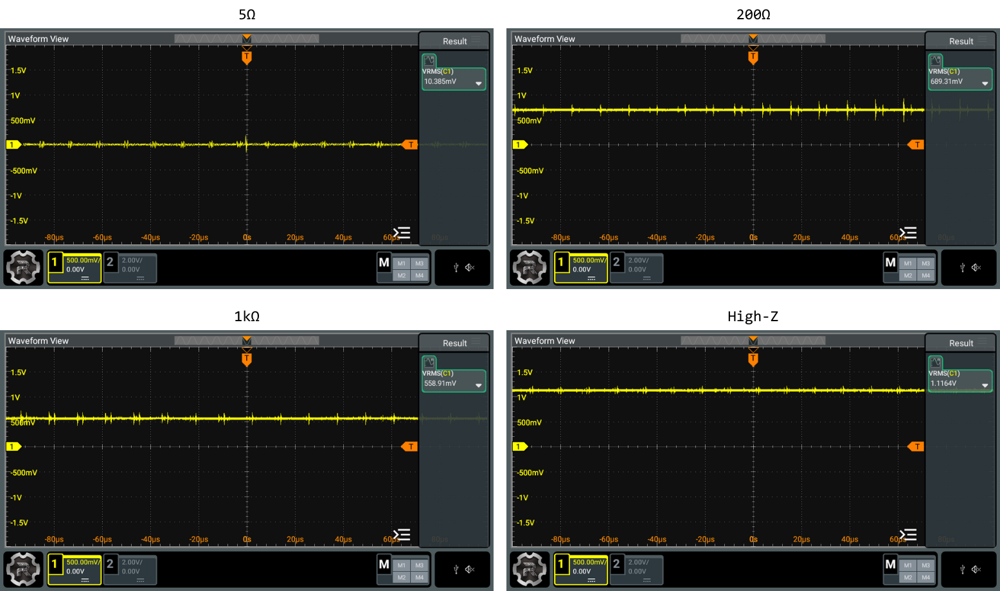
</p>

The ESP32's ADC provides a versatile and powerful way to read analog signals with a resolution of up to 12 bits and operates with a reference voltage of 0V to 3.3V (the default voltage range). Below is the formula to calculate the voltage per level for the ADC at 12-bit resolution.

$Voltage \ per \ Level = \frac{Voltage \ Range}{2^{Resolution}} = \frac{3.3V - 0V}{2^{12}} = \frac{3.3V}{4096} ≈ 0.00080586V ≈ 0.80586 mV$

Below is the formula to calculate the ADC value based on the voltage sense and the Voltage per Level.

$ADC \ Value = \frac{V_{sense}}{Voltage \ per \ Level}$

Using the formula above, we have the following ADC values for different pad resistances:

<div align="center">

| Pad Resistance | Measured Voltage | ADC Value |
| -------------: | ---------------: | --------: |
|             5Ω |        10.385 mV |        19 |
|           200Ω |        558.91 mV |       694 |
|            1kΩ |        689.31 mV |       855 |
|         High-Z |        1116.4 mV |      1385 |

</div>

## 2.3. Controller
### 2.3.1. PWM Generator
#### 2.3.1.1. Using the Remote Control Module (RMT) of ESP32 for Generating PWM Signals
The Remote Control Module (RMT) on the ESP32 is a versatile hardware peripheral designed primarily for sending and receiving infrared signals. However, it can also be effectively utilized to generate precise Pulse Width Modulation (PWM) signals.

#### 2.3.1.2. Key Concepts
- Duty Cycle:<br>The duty cycle of a PWM signal is the percentage of one cycle in which the signal is high (on) versus low (off). It is typically expressed as a value between 0 and 100.
- Total Period:<br>The total period of the PWM signal is the sum of the HIGH time and LOW time.

#### 2.3.1.3. Configuration
##### a. Clock Divider
The clock divider is a crucial parameter in microcontroller and digital circuit design that determines the frequency of a clock signal by dividing the input clock frequency, which is APB_CLK (80 MHz) for ESP32.

$Clock \ Divider = \frac{APB \_ CLK}{Clock \ Frequency}$

##### b. Resolution
The resolution in duty cycle is a crucial parameter in microcontroller and digital circuit design that determines the granularity of control over the PWM signal. It defines how finely the duty cycle can be adjusted, allowing for precise modulation of the output signal. In the case of the ESP32, the resolution is influenced by the clock frequency which ultimately affect the ability to achieve desired output levels.

$Resolution = \frac{Clock \ Frequency}{PWM \ Frequency}$

##### c. Combination of Clock Frequency and Resolution
The combination of clock frequency and resolution plays a vital role in determining the performance of PWM signals in microcontroller applications. The clock frequency sets the base rate at which the system operates, while the resolution defines how many discrete levels the duty cycle can be divided into. A higher clock frequency allows for faster switching and more precise timing, while a higher resolution enables finer control over the duty cycle. Together, they influence the accuracy and responsiveness of the PWM output, making it essential to balance these parameters to meet the specific requirements of the application.

<div align="center">

| Mode          | f PWM    | f Clock  | Clock Div | Resolution | 
| ------------- | -------: | -------: | --------: | ---------: |
| Pure Cut      |  400 kHz |   80 MHz |         1 |        200 |
| Blend Cut 1   |  400 kHz |   80 MHz |         1 |        200 |
| Blend Cut 2   |  400 kHz |   80 MHz |         1 |        200 |
| Coag Spray    |   25 kHz |   10 MHz |         8 |        800 |
| Coag Forced   |   20 kHz |   10 MHz |         8 |       1000 |
| Coag Standard |  400 kHz |   80 MHz |         1 |        200 |

</div>

#### 2.3.1.4. Output Scope
##### a. 400kHz
- Pattern 1
<br>The image illustrates the output scope for the Pattern 1 (Pure Cut operation) at the PWM generator. It provides a detailed view of the waveform characteristics and performance metrics associated with the Pure Cut process, highlighting the key features and behavior of the PWM signal during this operation.
<br>For discrete levels ranging from 10 to 100, demonstrates similar PWM frequency, indicating consistent performance across these duty cycle settings.

> [!NOTE]
> 400kHz PWM signal utilize a discrete resolution of 200 levels.

<p align="center"></p>
<p align="center"></p>
<p align="center"></p>
<p align="center">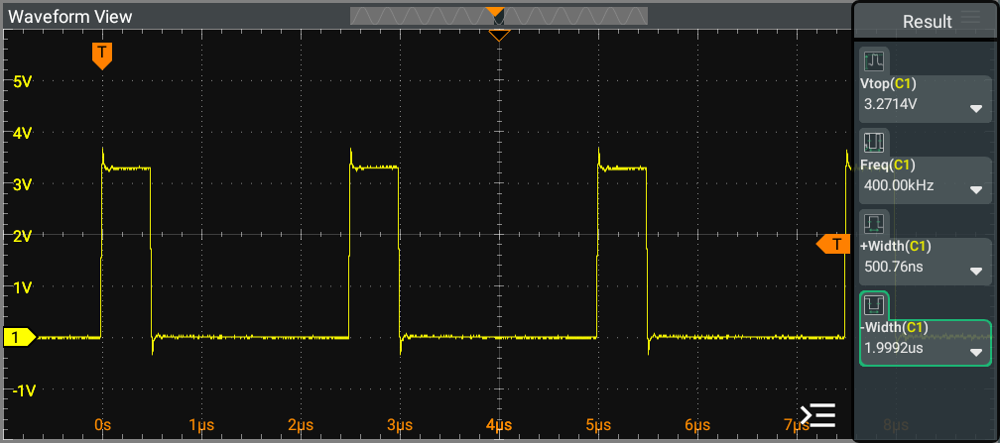</p>
<p align="center">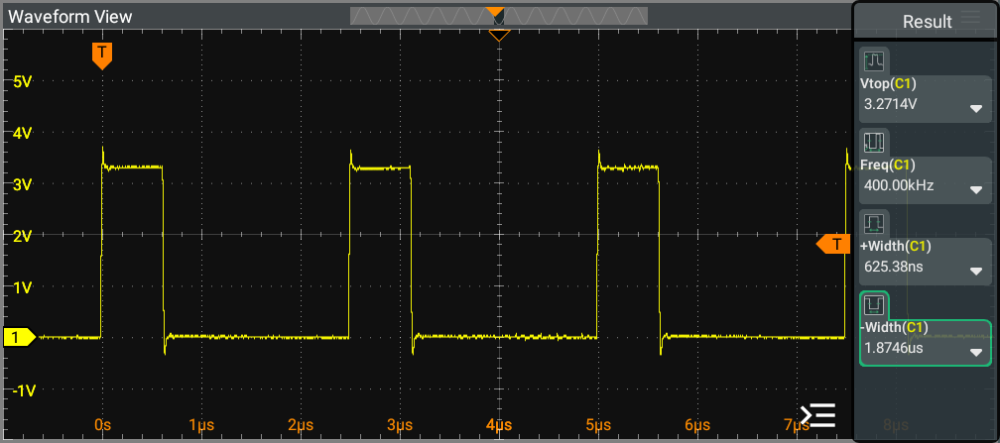</p>
<p align="center">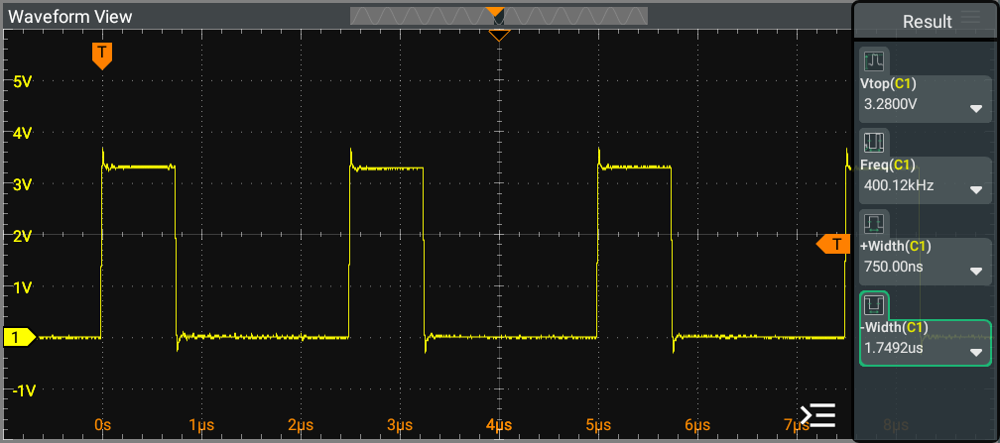</p>
<p align="center">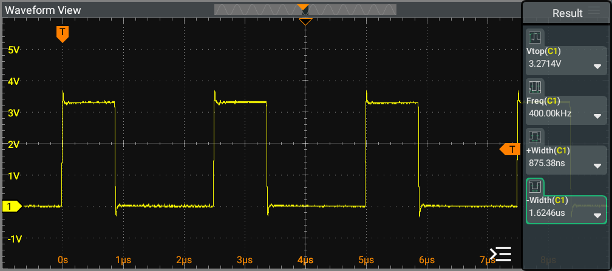</p>
<p align="center"></p>
<p align="center">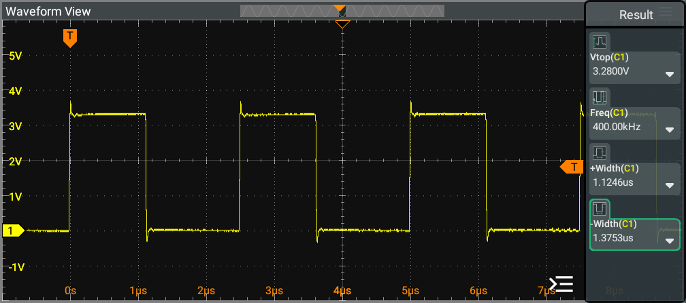</p>
<p align="center"></p>

<!-- <p align="center">
  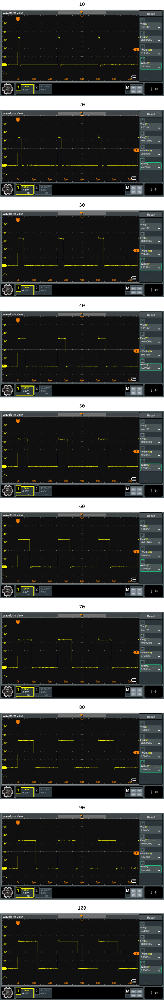
</p> -->

- Pattern 2<br>
The image illustrates the output scope for the Pattern 2 (Blend Cut 1) operation at the PWM generator. It provides a detailed view of the waveform characteristics and performance metrics associated with the Blend Cut process, highlighting the key features and behavior of the PWM signal during this operation.<br>
For discrete levels ranging from 10 to 100, demonstrates similar PWM frequency and similar waveform HIGH state periods, indicating consistent performance across these duty cycle settings. Each pulse in Blend Cut 1 is similar to a single pulse of a Pattern 1 (Pure Cut) PWM signal.

> [!NOTE]
> Pattern 2: 18 pulses per 1 modulation (400 kHz for each pulse, with 0% PWM during the last 2 periods).<br>This pattern utilize a discrete resolution of 200 levels, similar to that of a Pattern 1 (Pure Cut) PWM signal.

<p align="center">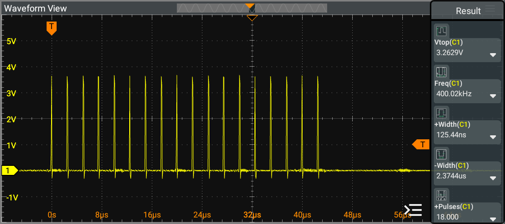</p>
<p align="center">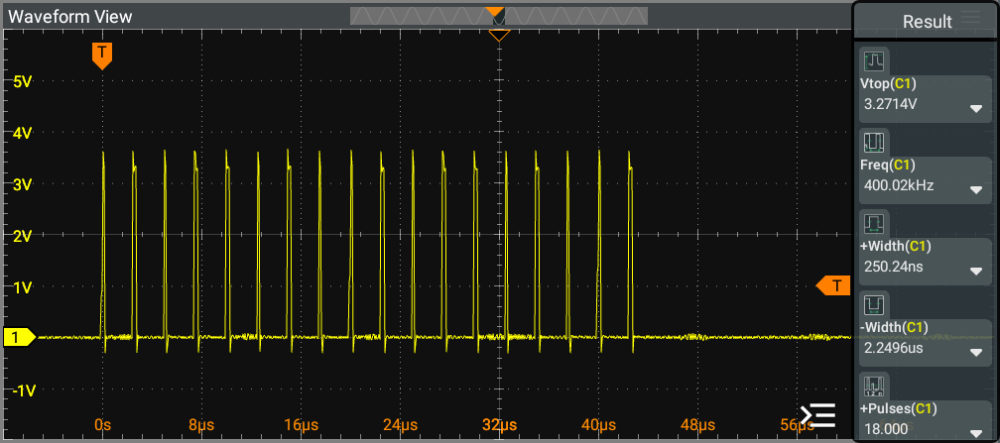</p>
<p align="center"></p>
<p align="center">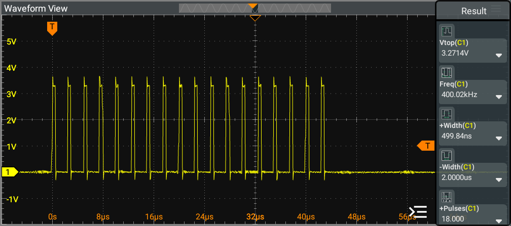</p>
<p align="center">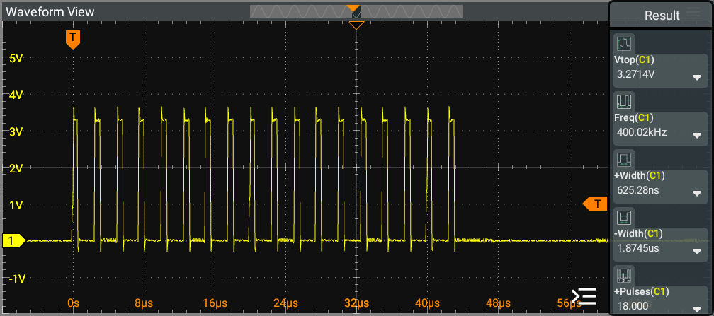</p>
<p align="center">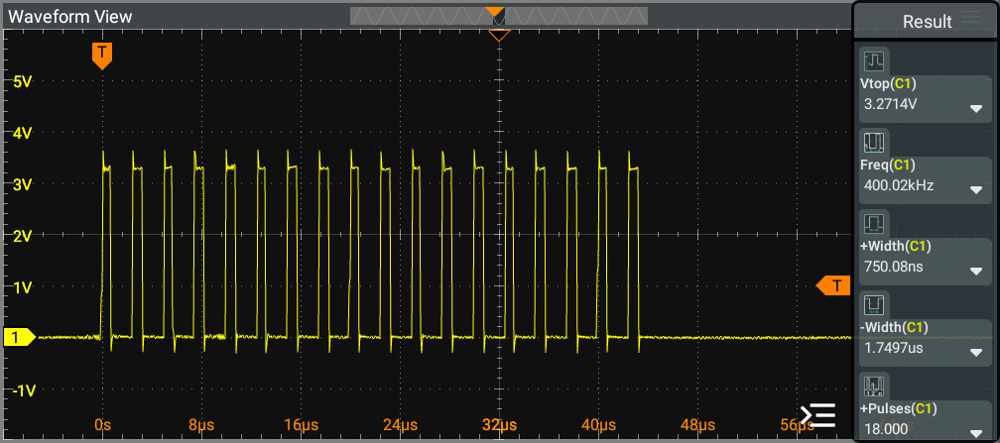</p>
<p align="center"></p>
<p align="center">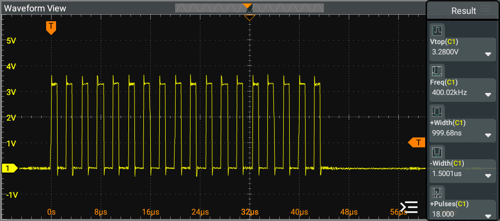</p>
<p align="center">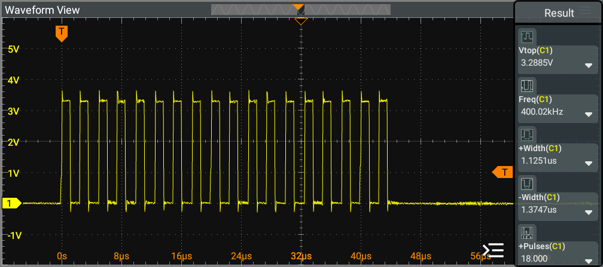</p>
<p align="center"></p>

- Pattern 3
<br>The image illustrates the output scope for the Pattern 3 (Blend Cut 2) operation at the PWM generator. It provides a detailed view of the waveform characteristics and performance metrics associated with the Blend Cut process, highlighting the key features and behavior of the PWM signal during this operation.
<br>For discrete levels ranging from 10 to 100, demonstrates similar PWM frequency and similar waveform HIGH state periods, indicating consistent performance across these duty cycle settings. Each pulse in Blend Cut 2 is similar to a single pulse of a Pure Cut PWM signal.

> [!NOTE]
> Pattern 3: 17 pulses per 1 modulation (400 kHz for each pulse, with 0% PWM during the last 3 periods).<br>This pattern utilize a discrete resolution of 200 levels, similar to that of a Pattern 1 (Pure Cut) PWM signal.

<p align="center"></p>
<p align="center">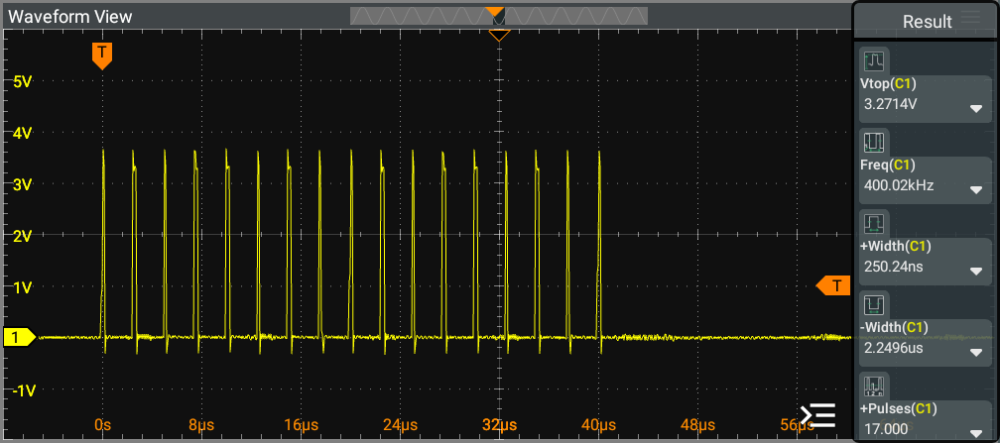</p>
<p align="center">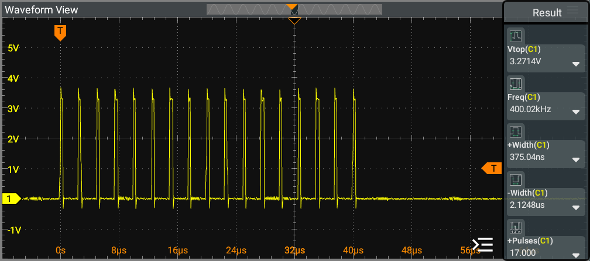</p>
<p align="center">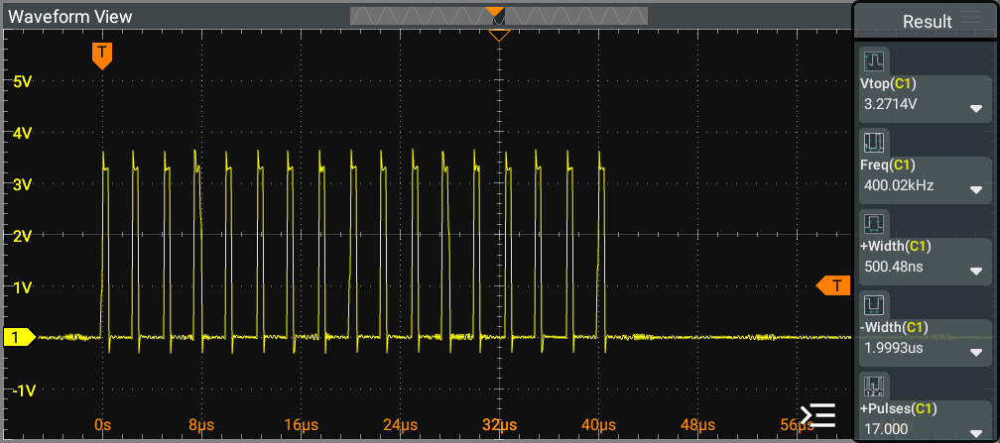</p>
<p align="center">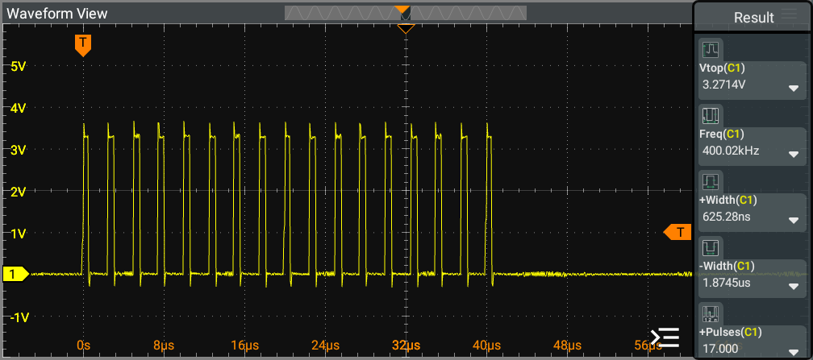</p>
<p align="center">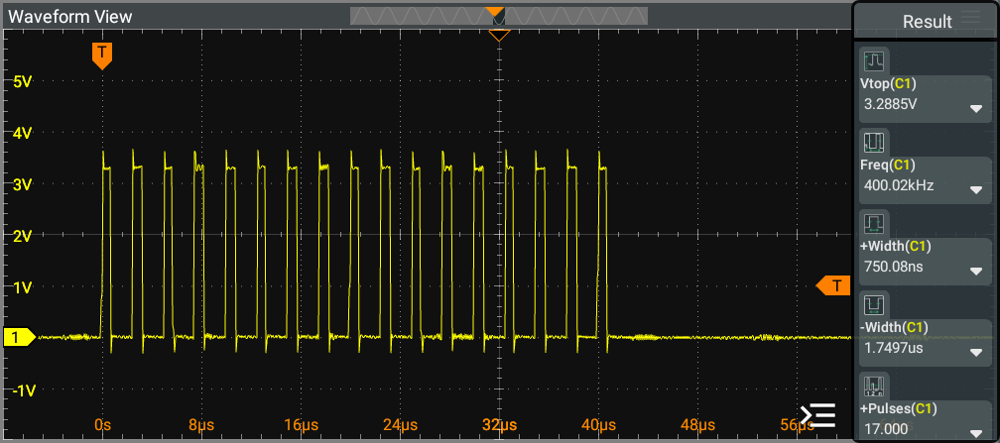</p>
<p align="center"></p>
<p align="center"></p>
<p align="center"></p>
<p align="center">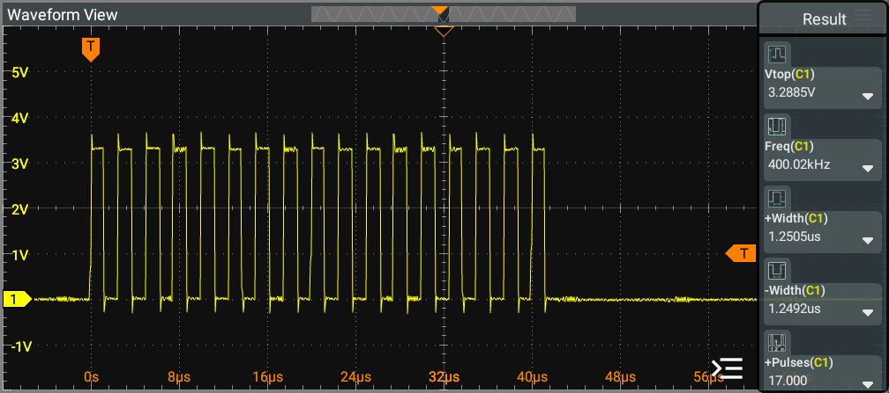</p>


<!-- <p align="center">
  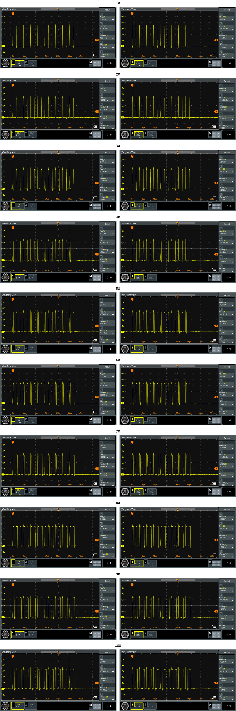
</p> -->

##### b. 25kHz
The image illustrates the output scope for the 25kHz (Spray Coagulation operation) at the PWM generator. It provides a detailed view of the waveform characteristics and performance metrics associated with the Spray Coagulation process, highlighting the key features and behavior of the PWM signal during this operation.

For discrete levels ranging from 10 to 100, demonstrates similar PWM frequency, indicating consistent performance across these duty cycle settings. We can observe that the increment of the duty cycle results in a pulse that exhibits a linear increase in HIGH time, further emphasizing the effectiveness of the PWM modulation in maintaining a predictable response across varying duty cycle levels.

> [!NOTE]
> 25kHz PWM signal utilize a discrete resolution of 800 levels.

<p align="center">
  <p align="center"></p>
  <p align="center">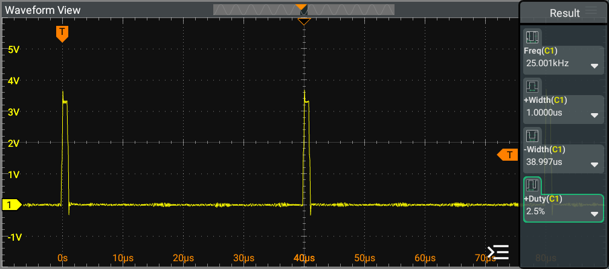</p>
  <p align="center"></p>
  <p align="center"></p>
  <p align="center"></p>
  <p align="center"></p>
  <p align="center"></p>
  <p align="center"></p>
  <p align="center"></p>
  <p align="center"></p>
</p>

<div align="center">

| Discrete Level  | Duty Cycle  | HIGH Time | LOW Time  |
| ---------------:| -----------:| ---------:| ---------:|
|              10 |      1.25 % |    0.5 µs |   39.5 µs |
|              20 |      2.50 % |    1.0 µs |   39.0 µs |
|              30 |      3.75 % |    1.5 µs |   38.5 µs |
|              40 |      5.00 % |    2.0 µs |   38.0 µs |
|              50 |      6.25 % |    2.5 µs |   37.5 µs |
|              60 |      7.50 % |    3.0 µs |   37.0 µs |
|              70 |      8.75 % |    3.5 µs |   36.5 µs |
|              80 |     10.00 % |    4.0 µs |   36.0 µs |
|              90 |     11.25 % |    4.5 µs |   35.5 µs |
|             100 |     12.50 % |    5.0 µs |   35.0 µs |

</div>

##### c. 20kHz
The image illustrates the output scope for the 20kHz (Forced Coagulation operation) at the PWM generator. It provides a detailed view of the waveform characteristics and performance metrics associated with the Forced Coagulation process, highlighting the key features and behavior of the PWM signal during this operation.

For discrete levels ranging from 10 to 100, demonstrates similar PWM frequency, indicating consistent performance across these duty cycle settings. We can observe that the increment of the duty cycle results in a pulse that exhibits a linear increase in HIGH time, further emphasizing the effectiveness of the PWM modulation in maintaining a predictable response across varying duty cycle levels.

> [!NOTE]
> 20kHz PWM signal utilize a discrete resolution of 1000 levels.

<p align="center">
  <p align="center">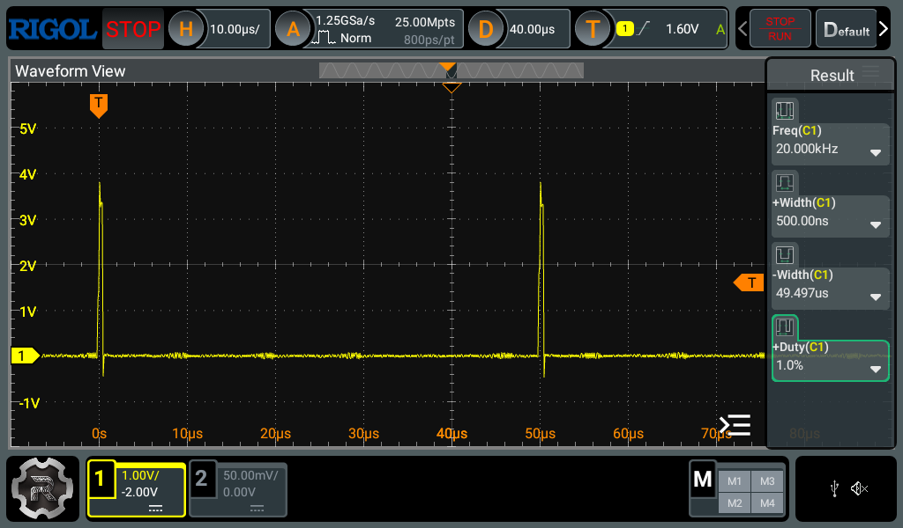</p>
  <p align="center"></p>
  <p align="center"></p>
  <p align="center"></p>
  <p align="center">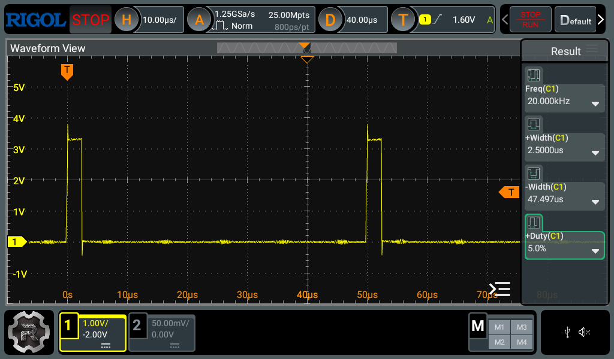</p>
  <p align="center"></p>
  <p align="center"></p>
  <p align="center"></p>
  <p align="center"></p>
  <p align="center"></p>
</p>

<div align="center">

| Discrete Level  | Duty Cycle  | HIGH Time | LOW Time  |
| ---------------:| -----------:| ---------:| ---------:|
|              10 |      1.00 % |    0.5 µs |   49.5 µs |
|              20 |      2.00 % |    1.0 µs |   49.0 µs |
|              30 |      3.00 % |    1.5 µs |   48.5 µs |
|              40 |      4.00 % |    2.0 µs |   48.0 µs |
|              50 |      5.00 % |    2.5 µs |   47.5 µs |
|              60 |      6.00 % |    3.0 µs |   47.0 µs |
|              70 |      7.00 % |    3.5 µs |   46.5 µs |
|              80 |      8.00 % |    4.0 µs |   46.0 µs |
|              90 |      9.00 % |    4.5 µs |   45.5 µs |
|             100 |     10.00 % |    5.0 µs |   45.0 µs |

</div>

### 2.3.2. Communication Protocol
<!-- 0x5000-0x7FFF can be used as the variable address range; 0x8000-0xFFFF -->
The system UART mode is fixed to 8N1, and the baud rate is 115200.

**Frame Structure**

The data frame consists of 5 data blocks:

```[HEADER] [LENGTH] [INSTRUCTION] [PAYLOAD] [CRC]```

**Frame Components**

<table>
  <thead>
    <tr>
      <td>Block</td>
      <td>Size [byte]</td>
      <td>Description</td>
      <td>Value</td>
    </tr>
  </thead>
  <tbody>
    <tr>
      <td>HEADER</td>
      <td>2</td>
      <td>Frame start marker</td>
      <td>0x5A 0XA5</td>
    </tr>
    <tr>
      <td>LENGTH</td>
      <td>1</td>
      <td>Total bytes after HEADER</td>
      <td>INSTRUCTION + DATA + CRC</td>
    </tr>
    <tr>
      <td>INSTRUCTION</td>
      <td>1</td>
      <td>Instruction Code</td>
      <td>0x82 : Write<br>0x83 : Read</td>
    </tr>
    <tr>
      <td>PAYLOAD</td>
      <td>0 - 3</td>
      <td>Payload data</td>
      <td></td>
    </tr>
    <tr>
      <td>CRC</td>
      <td>2</td>
      <td>Cyclic Redundancy Check</td>
      <td></td>
    </tr>
  </tbody>
</table>

The `PAYLOAD` frame consist 3 data blocks:

```[VP ADDRESS] [NUMBER OF WORDS] [DATA]```

<table>
  <thead>
    <tr>
      <td>Block</td>
      <td>Size [byte]</td>
      <td>Description</td>
    </tr>
  </thead>
  <tbody>
    <tr>
      <td>VP ADDRESS</td>
      <td>2</td>
      <td>Variable Pointer address to read from</td>
    </tr>
    <tr>
      <td>NUMBER OF WORDS</td>
      <td>1</td>
      <td>Number of data words to read (always 1)</td>
    </tr>
    <tr>
      <td>DATA</td>
      <td>2</td>
      <td>Data word read from the specified VP address</td>
    </tr>
  </tbody>
</table>

#### 2.3.2.1. Basic System Operations

<table>
  <thead>
    <tr>
      <td nowrap>Command</td>
      <td nowrap>Variable</td>
      <td nowrap>VP ADDRESS</td>
      <td nowrap>Data Frame</td>
      <td nowrap>Response</td>
    </tr>
  </thead>
  <tbody>
    <tr></tr>
    <tr>
      <td nowrap>System status query</td>
      <td><pre>(byte) dt_50[0]</pre></td>
      <td><pre>50 00</pre></td>
      <td><pre>5A A5 08 [INSTRUCTION] 50 00 01 00 [DATA] CRC:L CRC:H</pre></td>
      <td nowrap></td>
    </tr>
    <tr></tr>
    <tr>
      <td nowrap>System reset</td>
      <td><pre>(byte) dt_50[1]</pre></td>
      <td><pre>50 01</pre></td>
      <td><pre>5A A5 [INSTRUCTION] 83 50 01 01 00 [DATA] CRC:L CRC:H</pre></td>
      <td nowrap></td>
    </tr>
    <tr></tr>
    <tr>
      <td nowrap>Stop all RMT transmission</td>
      <td><pre>(byte) dt_50[2]</pre></td>
      <td><pre>50 02</pre></td>
      <td><pre>5A A5 08 [INSTRUCTION] 50 02 01 00 [DATA] CRC:L CRC:H</pre></td>
      <td nowrap></td>
    </tr>
  </tbody>
</table>

#### 2.3.2.2. Mode selection command without discrete level adjustment
  <table>
    <thead>
      <tr>
        <td>Command</td>
        <td>Variable</td>
        <td>VP ADDRESS</td>
        <td>Data Frame</td>
        <td>Response</td>
      </tr>
    </thead>
    <tbody>
      <tr>
        <td>Mode Selection Cut</td>
        <td> <pre>(int) dt_51[0] </pre></td>
        <td> <pre>51 00 </pre></td>
        <td> <pre>5A A5 08 [INSTRUCTION] 50 00 01 00 [data] CRC:L CRC:H </pre></td>
        <td></td>
      </tr>
      <tr>
        <td>Mode Selection Coag</td>
        <td> <pre>(int) dt_51[1] </pre></td>
        <td> <pre>51 01 </pre></td>
        <td> <pre>5A A5 08 [INSTRUCTION] 50 01 01 00 [data] CRC:L CRC:H </pre></td>
        <td></td>
      </tr>
    </tbody>
  </table>

##### b. 2 Data Blocks <[COMMAND] [DATA 1]>
###### COMMAND = 0
- Description: Mode selection command without discrete level adjustment.
- Parameters:
  - COMMAND: Command identifier, must be 0
  - DATA 1: Mode selection (0-5)

| DATA 1 |	Auto-assigned Channel | Description       | Example |	Success Response  |	Error Response  |
|:------:|:----------------------:|:----------------- |:------- |:-----------------:|:---------------:|
| 0      |	Channel 0             |	Pure cut          | 0 0     |	00	              | N/A             |
| 1      |	Channel 0             |	Cut pattern 2     | 0 1     |	00	              | N/A             |
| 2      |	Channel 0             |	Cut pattern 3     | 0 2     |	00	              | N/A             |
| 3      |	Channel 1             |	Coag Spray        | 0 3     |	00	              | N/A             |
| 4      |	Channel 1             |	Coag Forced       | 0 4     |	00	              | N/A             |
| 5      |	Channel 1             |	Bipolar Standard  | 0 5     |	00	              | N/A             |
| Other  |	N/A	                  | Invalid           | 0 6     | N/A	              | 02              |

##### c. 3 Data Blocks <[COMMAND] [DATA 1] [DATA 2]>
###### COMMAND = 1
- Description: Mode and discrete level adjustment command.
- Parameters:
  - COMMAND: Command identifier, must be 1
  - DATA 1: Mode selection (0-5)
  - DATA 2: discrete level value (range varies by mode)

| Mode  |	Discrete Level  |	Description         |	Example |	Success Response  |	Error Response  |
|:-----:|:---------------:|:------------------- |:------- |:-----------------:|:---------------:|
| 0     |	        0 - 200 |	Pure cut            |	1 0 100 |	00	              | 02              |
| 1     |	        0 - 200 |	Cut pattern 1       |	1 1 150 |	00	              | 02              |
| 2     |	        0 - 200 |	Cut pattern 2       |	1 2 120 |	00	              | 02              |
| 3     |	        0 - 400 |	Coag Spray          |	1 3 250 |	00	              | 02              |
| 4     |	        0 - 500 |	Coag Forced         |	1 4 300 |	00	              | 02              |
| 5     |	        0 - 200 |	Bipolar Standard    |	1 5 80  |	00	              | 02              |
| Other |	            N/A	| Invalid	            | 1 6 100 |	N/A	              | 02              |

#### 2.3.2.2. Write

## 2.4. Power Stage
### 2.4.1. HF Switch
#### 2.4.1.1. Schematic

<p align="center">
  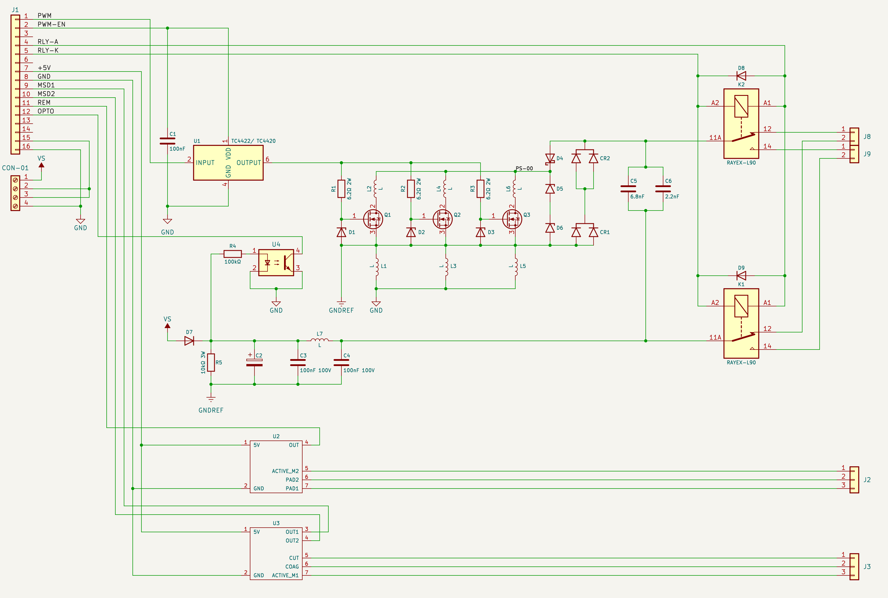
</p>

#### 2.4.1.2. MOSFET Driver
We use the TC4420 as our MOSFET driver due to its high-speed performance and ability to efficiently drive N-channel MOSFETs in various applications. The TC4420 provides a peak output current of up to 6A, allowing for rapid charging and discharging of the MOSFET gate capacitance. This capability minimizes switching losses and enhances overall efficiency in power management.

Operating within a supply voltage range of 4.5V to 18V, the TC4420 can effectively drive MOSFET gates at a voltage level of 12V, ensuring that the MOSFET turns on fully for optimal performance. Its fast switching speed, with propagation delays in the nanosecond range (typically 55ns), is crucial for high-frequency applications, reducing transition times and heat generation.

#### 2.4.1.3. Utilizing Three IRFPE50 MOSFETs in Parallel for Enhanced Performance and Reliability
We use three IRFPE50 MOSFETs in parallel to enhance the overall performance and reliability of our circuit. The decision to parallel these MOSFETs is driven by several key factors:
- Increased Current Handling:<br>Each IRFPE50 MOSFET has a maximum continuous drain current rating of ID=7.8A at TC=25°C and ID=4.9A at TC=100°C. By connecting three times as many of them in parallel, we effectively triple the total current handling capability. This is particularly beneficial in applications where high current loads are expected, ensuring that the circuit can handle the demands without overheating or exceeding the MOSFET's ratings.
- Improved Thermal Management:<br>Paralleling MOSFETs helps distribute the heat generated during operation across multiple devices. This reduces the thermal stress on each individual MOSFET, allowing for better thermal management. Proper heat dissipation is crucial for maintaining performance and preventing thermal runaway, especially in high-power applications.
- Lower On-Resistance:<br>The IRFPE50 has a low on-resistance (RDS(on)) of approximately 1.2Ω. When MOSFETs are paralleled, the effective on-resistance decreases, which results in lower conduction losses. This is advantageous for improving the efficiency of the circuit, as it minimizes the voltage drop across the MOSFETs when they are in the on state.
- Redundancy and Reliability:<br>Using multiple MOSFETs in parallel provides a level of redundancy. If one MOSFET were to fail, the remaining devices can continue to operate, thereby enhancing the overall reliability of the circuit. This is particularly important in critical applications where failure could lead to significant issues.

#### 2.4.1.4. Output Scope
##### a. 400kHz
The image illustrates the output scope for the 400kHz operation at:
- MOSFET Driver Output (blue)
- MOSFET Drain Pin (yellow)
- VDS=72V

It provides a detailed view of the waveform characteristics and performance metrics associated with the Pure Cut process, highlighting the key features and behavior of the HF Switch signal during this operation.
<br>For discrete levels ranging from 20 to 180, demonstrates similar Waveform frequency, indicating consistent performance across these duty cycle settings.

> [!NOTE]
> 400kHz PWM signal utilize a discrete resolution of 200 levels.

<!-- <p align="center">
  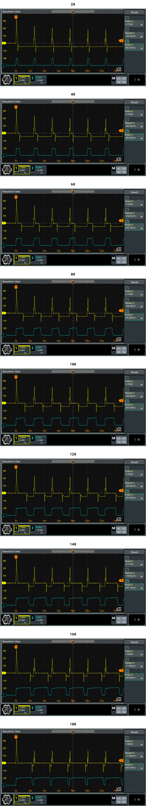
</p> -->

##### b. 25KHz

##### c. 25KHz

### 2.4.2. Transformer
**Toroidal Ferrite Core Transformer**

A toroidal ferrite core transformer is a type of transformer that uses a ring-shaped (toroidal) core made from ferrite material. Ferrite is a ceramic compound consisting of iron oxide mixed with other metals, which provides high magnetic permeability and low electrical conductivity. This makes ferrite ideal for high-frequency transformer applications.

**Structure and Construction**
- Core Shape<br>
  The core is a closed loop (doughnut-shaped), which helps confine the magnetic flux within the core material, minimizing leakage and electromagnetic interference (EMI).
- Windings<br>
  Copper wire is wound around the toroidal core, usually with primary and secondary windings placed concentrically. The windings can be distributed evenly around the core to further reduce leakage inductance and stray fields.
- Ferrite Material<br>
  Ferrite cores are preferred for high-frequency operation (tens of kHz to several MHz) because they have low core losses at these frequencies compared to laminated iron cores.

**Key Advantages**
- High Efficiency<br>
  The closed magnetic path of the toroid reduces core losses and leakage flux, resulting in higher efficiency.
- Low Electromagnetic Interference (EMI)<br>
  The toroidal shape confines the magnetic field, reducing EMI and making these transformers suitable for sensitive electronic circuits.
- Compact Size<br>
  For a given power rating, toroidal transformers are generally smaller and lighter than their laminated counterparts.
- Quiet Operation<br>
  The core shape and material minimize audible hum and vibration.

**Power Handling**

The transformer’s power rating is determined by the product of output voltage and current, and the core must be sized to avoid saturation at maximum load.

**Skin Effect**

At high frequencies, the skin effect is a phenomenon in alternating current (AC) where the current density becomes highest at the surface of a conductor and decreases exponentially toward the center. This occurs because the alternating current generates a changing magnetic field, which in turn induces **eddy currents** within the conductor. These eddy currents oppose the main current flow more strongly at the center, forcing most of the AC current to flow near the surface. As a result, the effective cross-sectional area available for current flow is reduced, increasing the effective resistance of the wire at higher frequencies.

<p align="center">
  
</p>

The depth at which the current density falls to 37% of its value at the surface.

$δ = \sqrt{ \frac{ ρ } { π • f • μ } }$

Where:
- ρ = resistivity of the conductor (Ω·m)
- μ = permeability of the conductor (H/m)
- f = frequency (Hz)

For high-frequency windings, consider using multiple thinner wires in parallel (Litz wire) to reduce skin effect losses.

The calculated diameter above is based on DC or low-frequency AC. For high-frequency applications, the effective area may be less than the physical area due to skin effect.

#### 2.4.2.1. Design and Calculation
<!-- Given:
- Input voltage<br>$V_{in} = 72 \ V$
- Output voltage<br>$V_{out} = 216 \ V$
- Switching frequency<br>$f = 400 \ kHz = 400,000 \ Hz$
- Core dimensions:
  - Inner diameter<br>$ID = 23.3 \ mm$
  - Outer diameter<br>$OD = 40.4 \ mm$
  - Height<br>$H = 15.1 \ mm$
- Maximum flux density<br>$B_{max} = 350 \ Gauss$
- Output current<br>$I_{out} = 0.5 \ A$ -->

##### a. Core Cross-Sectional Area ($A_e$)
The effective cross-sectional area of the core is calculated as:

$A_e = \frac{( OD – ID ) • H }{ 2 }$

<!-- $A_e  = \frac{( 40.4 – 23.3 ) • 15.1 }{ 2 } = 129.1 \ mm^2$ -->

This area is important for determining how much magnetic flux the core can handle without saturating.

##### b. Primary Turns ($N_p$)
The number of primary turns is determined by:

$N_p = \frac{ V_{in} • Duty \ Cycle • 10^{10} }{ 2 • f • B_{max} • A_e }$

<!-- $N_p = \frac{ 72 • 0.5 • 10^{10} }{ 2 • 400,000 • 350 • 129.1 } = \frac{ 360,000,000,000 }{ 36,149,400,000 }$

$N_p = 9.96 ≈ 10 \ turns$ -->

This ensures the core does not saturate at the maximum input voltage and duty cycle.

##### c. Volt per Turn
The voltage induced per turn is:

$Volt \ per \ turn = \frac{ V_{in} }{ N_p }$

<!-- $Volt \ per \ turn = \frac{ 72 }{ 10 } = 7.2 \ V/turn$ -->

##### d. Secondary Turns ($N_s$)
The number of secondary turns is:

$N_s = \frac{ V_{out} }{ Volt \ per \ turn }$

<!-- $N_s = \frac{ 216 }{ 7.2 } = 30 \text{ turns}$ -->

This ensures the transformer provides the correct output voltage.

##### e. Output Power and Currents ($N_s$)
$P = V_{out} • I_{out}$

<!-- $P = 216 • 0.5 = 108 \ W$ -->

$I_{in} = \frac{ P }{ V_{in} }$

<!-- $I_{in} = \frac{ 108 }{ 72 } = 1.5 \ A$ -->

These calculations confirm the input current required to deliver the desired output power.

For high-frequency applications, we need to consider:
- **Skin effect** - Current tends to flow on the surface of conductors at high frequencies
- **Current density** - Typically 1.5-3 A/mm² for transformer applications
- **Temperature rise** - Higher current density = more heat

##### f. Wire Diameter
To calculate the required wire diameter for a given current, use the formula:<br><br>
$dW = \sqrt{ \frac{ 4 • I }{ \pi • J } }$

Where:
- $dW = wire \ diameter$
- $I = current \ (A)$
- $J = current \ density \ (A/mm^2)$

<!-- Primary:
- $I_{in} = 1.5 \ A$
- $Current \ Density = 1.5 \ A/mm^2$
- $dW_p = \sqrt{ \frac{ 4 • 1.5 }{ 3.14 • 1.5 } } = \sqrt{ \frac{ 6 }{ 4.712 } } = 1.13 \ mm$

Secondary:
- $I_{out} = 0.5 \ A$
- $Current \ Density = 1.5 \ A/mm^2$
- $dW_s = \sqrt{ \frac{ 4 • 0.5 }{ 3.14 • 1.5 } } = \sqrt{ \frac{ 2 }{ 4.712 } } = 0.65 \ mm$ -->

##### g. High-Frequency Considerations
The skin depth in copper is approximately calculated by following formula:

$δ = \sqrt{ \frac{ ρ } { π • f • μ } }$

If our calculated wire diameters are larger than 2× skin depth, consider using:
1. **Litz wire** for better high-frequency performance
2. **Multiple parallel smaller wires** instead of single thick wire with individual wire diameter 2x skin depth
3. **Stranded wire** with individual strand diameter 2x skin depth

##### h. Wire Specification for High-Frequency Operation using Stranded wire
Required copper area is the net copper cross‑section needed to carry the target current without exceeding your thermal/current‑density limit. Pick $J$ based on allowed temperature rise and cooling. Typical transformer design uses $J=1.5$–$3.0$ A/mm²; choose the lower end for continuous duty, compact windings, or poor airflow; higher values may be acceptable for pulsed or well‑cooled designs.

$A_{req} = \frac{I}{J}$

Area per strand is the metallic copper area of a single strand. Use the bare copper diameter (exclude enamel). If you only have an enamelled wire gauge, subtract twice the enamel thickness to estimate bare diameter, or use datasheet bare area.

$A_{strand} = \frac{pi • d_{strand}^2}{4}$

Number of strands is calculated by following formula

$N_{strands} = ⌈ \frac{A_{req}}{A_{strand} • η_{pack}} ⌉$

Where:
- $I = current \ (A)$
- $J = current \ density \ (A/mm^2)$
- $d_{strand} = strand \ diameter \ (mm)$
- $η_{pack} = packing/fill \ factor \ for \ round \ wires \ in \ a \ bundle \ (typically \ 0.7–0.9; \ use \ 1.0 \ if \ we \ ignore \ packing)$

<!-- - Primary
  - 32 parallel 0.2 mm each
  - Total current capacity: ~1.5A
  - Total equivalent area: ~1.0 mm²
- Secondary
  - 11 parallel 0.2 mm each
  - Total current capacity: ~0.5A
  - Total equivalent area: ~0.33 mm² -->

##### i. Wire Length Calculation
Length per turn (mean path around toroid)

$Length \ per \ turn = 2 • (\frac{OD - ID}{2} + H)$

Individual conductor length (per strand, includes ~10% leads allowance):

$Individual \ Length = 1.1 • N • Length \ per \ turn$

Total copper length for the bundle (all parallel strands combined):

$Total \ Length = N_{strands} • Individual \ Length$

$Total \ Wire \ Length \ Needed = Total \ Length_{\ p} + Total \ Length_{\ s}$
<!-- $Length \ per \ turn = 2 • (\frac{40.4 - 23.3}{2} + 15.1 ) = 47.3 \ mm$

- Primary
  - Number of Wire: 32
  - Turns: 10
  - $Individual \ Length = 10 • 47.3 • 1.1 ≈ 520 \text{ mm including 10\\% leads} $
  - $Total \ Length = 32 • 520 = 16640 \ mm = 16.64 \ m$
- Secondary
  - Number of Wire: 11
  - Turns: 30
  - $Individual \ Length = 30 • 47.3 • 1.1 ≈ 1561 \text{ mm including 10\\% leads}$
  - $Total \ Length = 11 • 1561 = 17171 \ mm = 17.17 \ m$

$Total \ Wire \ Length \ Needed = 16.64 + 17.17 = 33.81 \ m$ -->

##### j. Calculation Results Table for 400kHz and 100kHz

<div align="center">
  <table>
    <thead>
      <tr>
        <th>$f$<br>[Hz]</th>
        <th>$V_{in}$<br>[V]</th>
        <th>$V_{out}$<br>[V]</th>
        <th>$I_{out}$<br>[A]</th>
        <th>$P$<br>[W]</th>
        <th>$I_{in}$<br>[A]</th>
        <th>$ID$<br>[mm]</th>
        <th>$OD$<br>[mm]</th>
        <th>$H$<br>[mm]</th>
        <th>$A_e$<br>[mm²]</th>
        <th>$B_{max}$<br>[Gauss]</th>
        <th>$N_p$<br>[turns]</th>
        <th>$Volt \ per \ turn$<br>[V/turn]</th>
        <th>$N_s$<br>[turns]</th>
        <th>$J$<br>[A/mm²]</th>
        <th>$dW_p$<br>[mm]</th>
        <th>$dW_s$<br>[mm]</th>
        <th>$δ$<br>[mm]</th>
        <th>$d_{p \ strand}$<br>[mm]</th>
        <th>$d_{s \ strand}$<br>[mm]</th>
        <th>$N_{p \ strands}$</th>
        <th>$N_{s \ strands}$</th>
        <th>$Individual \ Length_{\ p}$<br>[m]</th>
        <th>$Total \ Length_{\ p}$<br>[m]</th>
        <th>$Individual \ Length_{\ s}$<br>[m]</th>
        <th>$Total \ Length_{\ s}$<br>[m]</th>
      </tr>
    </thead>
    <tbody align="right">
      <tr>
        <td>400,000</td>
        <td>72</td>
        <td>216</td>
        <td>0.5</td>
        <td>108</td>
        <td>1.5</td>
        <td>23.3</td>
        <td>40.4</td>
        <td>15.1</td>
        <td>129.1</td>
        <td>350</td>
        <td>10</td>
        <td>7.2</td>
        <td>30</td>
        <td>1.5</td>
        <td>1.13</td>
        <td>0.65</td>
        <td>0.103</td>
        <td>0.2</td>
        <td>0.2</td>
        <td>32</td>
        <td>11</td>
        <td>0.520</td>
        <td>16.65</td>
        <td>1.561</td>
        <td>17.17</td>
      </tr>
      <tr>
        <td>100,000</td>
        <td>72</td>
        <td>504</td>
        <td>0.2</td>
        <td>100</td>
        <td>1.4</td>
        <td>23.3</td>
        <td>40.4</td>
        <td>15.1</td>
        <td>129.1</td>
        <td>350</td>
        <td>40</td>
        <td>1.8</td>
        <td>279</td>
        <td>1.5</td>
        <td>1.09</td>
        <td>0.41</td>
        <td>0.206</td>
        <td>0.2</td>
        <td>0.2</td>
        <td>30</td>
        <td>5</td>
        <td>2.081</td>
        <td>62.44</td>
        <td>14.516</td>
        <td>72.58</td>
      </tr>
      <tr>
        <td>400,000</td>
        <td>48</td>
        <td>200</td>
        <td>0.5</td>
        <td>100</td>
        <td>2.08</td>
        <td>23.3</td>
        <td>40.4</td>
        <td>15.1</td>
        <td>129.1</td>
        <td>350</td>
        <td>7</td>
        <td>6.8</td>
        <td>29</td>
        <td>1.5</td>
        <td>1.33</td>
        <td>0.65</td>
        <td>0.103</td>
        <td>0.2</td>
        <td>0.2</td>
        <td>44</td>
        <td>11</td>
        <td>0.364</td>
        <td>16.03</td>
        <td>1.509</td>
        <td>16.60</td>
      </tr>
      <tr>
        <td>100,000</td>
        <td>48</td>
        <td>500</td>
        <td>0.2</td>
        <td>100</td>
        <td>2.08</td>
        <td>23.3</td>
        <td>40.4</td>
        <td>15.1</td>
        <td>129.1</td>
        <td>350</td>
        <td>27</td>
        <td>1.8</td>
        <td>281</td>
        <td>1.5</td>
        <td>1.33</td>
        <td>0.41</td>
        <td>0.206</td>
        <td>0.2</td>
        <td>0.2</td>
        <td>44</td>
        <td>5</td>
        <td>1.405</td>
        <td>61.81</td>
        <td>14.620</td>
        <td>73.10</td>
      </tr>
    </tbody>
  </table>
</div>


#### 2.4.2.2 Output Scope
##### a. 400kHz
The image illustrates the output scope at output transformer 400kHz with PWM frequency 400kHz
<br>For discrete levels ranging from 10 to 100, demonstrates similar Waveform length, indicating consistent performance across these duty cycle settings.

> [!NOTE]
> 400kHz PWM signal utilize a discrete resolution of 200 levels.

##### b. 25kHz
The image illustrates the output scope at output transformer 100kHz with PWM frequency 25kHz
<br>For discrete levels ranging from 10 to 100, demonstrates similar Waveform length, indicating consistent performance across these duty cycle settings.

> [!NOTE]
> 25kHz PWM signal utilize a discrete resolution of 400 levels.

##### c. 20kHz
The image illustrates the output scope at output transformer 100kHz with PWM frequency 20kHz
<br>For discrete levels ranging from 10 to 100, demonstrates similar Waveform length, indicating consistent performance across these duty cycle settings.

> [!NOTE]
> 20kHz PWM signal utilize a discrete resolution of 500 levels.

<!-- <p align="center">
  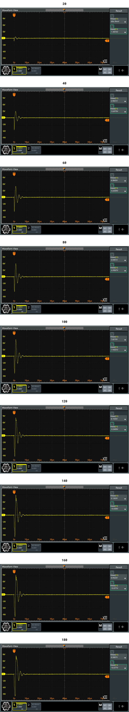
</p> -->

### 2.4.3. LC Filter
**Type 1 Butterworth Filter: Differential Filter**

A Type 1 Butterworth filter is a second-order low-pass filter that provides a maximally flat frequency response in the passband. The "Type 1" designation typically refers to the specific topology or configuration of the filter circuit. In the context of differential filters, this often means a balanced configuration that processes differential signals (signals with equal and opposite components).

**Differential Filter Configuration**

A differential filter is designed to handle differential signals, which are commonly used in high-speed digital circuits, audio systems, and communication equipment. The filter processes both the positive and negative components of the signal simultaneously, providing better noise immunity and common-mode rejection.

**Key Characteristics:**
- Balanced Input/Output<br>
  The filter has balanced input and output terminals, typically labeled as $V_{in+}$, $V_{in−}$, $V_{out+}$, and $V_{out−}$.
- Common-Mode Rejection<br>
  The filter can reject common-mode noise (noise that appears equally on both input lines) while amplifying the differential signal.
- Symmetrical Design<br>
  The filter components are arranged symmetrically to ensure equal processing of both signal components.

#### 2.4.3.1. Design and Calculation
##### a. Output Class-D LC Filter Frequency Response Properties
The frequency response of the second-order class-D LC output filter is critical when selecting the component values for the inductor and capacitor. The LC filter response also varies with load impedance. The load impedance determines the damping ratio of the output LC filter and is classified as:
- Overdamped
- Critically damped
- Underdamped

It is also important to understand the load impedance variations for the application and select the L and C values that suit the expected load variations. Ideally, the LC filter value is selected for a **critically damped, flat passband, and phase response**. Two considerations when selecting components for the second-order low-pass filter is:
- the cut-off frequency
- Q factor or damping ratio

<p align="center">
  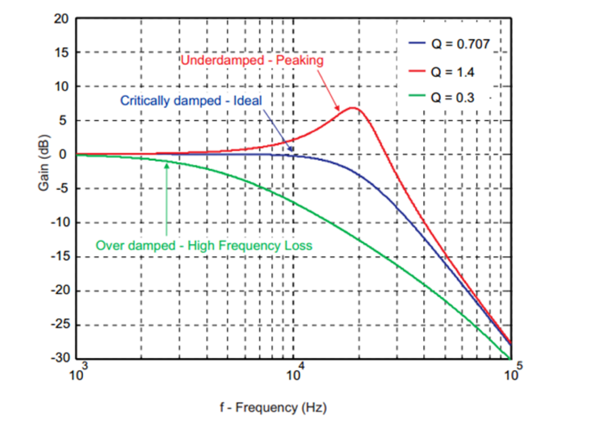
</p>

Texas Instrument recommends using a second-order Butterworth low-pass filter because of its flat pass-band and phase response. Texas Instrument does not recommend the use of LC filters that peak excessively, like the underdamped filter response shown in figure above. At high frequency, the peaks are generally harsh to the human ear and can also trigger the protection circuitry, such as overcurrent, of some amplifiers. However, overdamped filters result in attenuation of high-frequency signal content.

##### b. Single-Ended Equivalent, Design and Analysis
This section details the design and analysis of a Type 1 Butterworth Filter in single-ended  LC circuit equivalent.

<p align="center">
  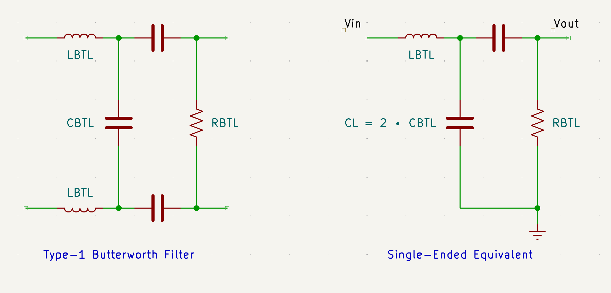
</p>

**Cut-off Frequency for single-ended LC Filter**

The cut-off frequency ($f_0$) of the LC filter is determined by the values of the inductor ($L_{BTL}$) and capacitor ($C_L$), using the formula:

$f_0 = \frac{ ⍵_0 }{ 2 • π } = \frac{ 1 }{ 2 • π • \sqrt{ L_{BTL} • C_L } }$

The quality factor ($Q$) describes the selectivity or sharpness of the filter’s response and is given by:

$Q = R_L • \sqrt{ \frac{ C_L }{ L_{BTL} } } $

where $R_L$ is the load resistance.

To design a filter that is critically damped with a Butterworth response, Q = 0.707 = 1/√2. By substituting Q = 1/√2 into equations for Cut-off Frequency and Quality Factor previously listed, L and C values can be derived for a critically damped system assuming the desired cut-off frequency, ωo, is known.

**Step-by-Step Calculation**
- **Start with the Quality Factor Equation**<br>
$Q = R_L • \sqrt{ \frac{ C_L }{ L_{BTL} } } = \frac{ 1 }{ \sqrt{ 2 } } $<br><br>
This equation relates the load resistance, capacitance, and inductance for a Butterworth response

- **Rearrange to Express $C_L$ in Terms of $L_{BTL}$ and $R_L$**<br>
$\sqrt{ \frac{ C_L }{ L_{BTL} } } = \frac{ 1 }{ R_L • \sqrt{ 2 } } → \frac{ C_L }{ L_{BTL} } = \frac{ 1 }{ R_L^2 • 2 }$<br><br>
$C_L = \frac{ L_{BTL} }{ R_L^2 • 2 }$<br><br>
This gives a direct relationship between the required capacitance and inductance for the chosen Q.

- **Substitute $C_L$ into the Cut-off Frequency formula**<br>
The cut-off frequency for an LC filter is:<br>
$f_0 = \frac{ 1 }{ 2 • π • \sqrt{ L_{BTL} • \frac{ L_{BTL} }{ R_L^2 • 2 } } }$<br><br>
$f_0 = \frac{ 1 }{ 2 • π • \sqrt{ \frac{ L_{BTL}^2 }{ R_L^2 • 2 } } }$<br><br>
$f_0 = \frac{ 1 }{ 2 • π • \frac{ L_{BTL} }{ R_L • \sqrt{ 2 } } }$<br><br>
$f_0 = \frac{ R_L • \sqrt{ 2 } }{ 2 • π • L_{BTL} }$<br><br>
This equation allows us to solve for the required inductance for a given cut-off frequency and load.

- **Solve for $L_{BTL}$ and $C_L$**<br>
Rearranging the above equation for $L_{BTL}$:<br>
$L_{BTL} = \frac{ R_L • \sqrt{ 2 } }{ 2 • π • f_0 }$<br><br>
And using the earlier relationship for $C_L$:<br>
$C_L = \frac{ 1 }{ 2 • π • f_0 • R_L • \sqrt{ 2 } }$<br><br>

<!-- - **Apply to a Practical Example**<br>
  - We have:
    - $R_{BTL} = 100Ω$
    - $f_0 = 400 \text{ kHz} = 400,000 \text{ Hz}$
  - For a single-ended equivalent:
    - $C_{BTL} = \frac{ C_L }{ 2 }$
    - $R_L = \frac{ R_{BTL} }{ 2 }$
  - Plugging in the values:
    - $L_{BTL} = \frac{ \frac{ R_{BTL} }{ 2 } • \sqrt{ 2 } }{ 2 • π • f_0 } = \frac{ \frac{ 100 }{ 2 } • \sqrt{ 2 } }{ 2 • 3.14 • 400,000 } = \frac{ 70.7106 }{ 2,512,000 }$<br><br>
      $L_{BTL} = 0.000028149155 \ H = 28.1492 \text{ µH}$
    - $C_{BTL} = \frac{ \frac{ 1 }{ 2 • π • f_0 • \frac{ R_{BTL} }{ 2 } • \sqrt{ 2 } } }{ 2 } = \frac{ \frac{ 1 }{ 2 • 3.14 • 400,000 • \frac{ 100 }{ 2 } • \sqrt{ 2 } } }{ 2 } = \frac{ \frac{ 1 }{ 2,512,000 • 70.7106 } }{ 2 }$<br><br>
      $C_{BTL} = 0.000000000281492 \ F = 2.81492 \ nF ≈ 2.7 \ nF$ -->

##### c. Frequency Response
With the targeted Q of 0.707 = 1/√2 and the cut-off frequency is:

$f_0 = \frac{ 1 }{ 2 • π • \sqrt{ L_{BTL} • C_L } } = \frac{ 1 }{ 2 • π • \sqrt{ L_{BTL} • 2 • C_{BTL} } }$

<!-- $f_0 = \frac{ 1 }{ 2 • 3.14 • \sqrt{ 28.1492 • 10^{-6} • 2 • 2.7 • 10^{-9} } } = \frac{ 1 }{ 2 • 3.14 • \sqrt{ 152 • 10^{-15} } } = \frac{ 1 }{ 2 • 3.14 • 3.8988 • 10^{-7} }$

$f_0 = 408,423.2417 \text{ Hz} = 408.423 \text{ kHz}$ -->

Using the standard inductor and capacitor values from the previous calculations, the Q factor for 100Ω load is:

$Q = R_L • \sqrt{ \frac{ C_L }{ L_{BTL} } } = \frac{ R_{BTL} }{ 2 } • \sqrt{ \frac{ 2 • C_{BTL} } { L_{BTL} } }$

<!-- $Q = \frac{ 100 }{ 2 } • \sqrt{ \frac{ 2 • 2.7 • 10^{-9} } { 28.14 • 10^{-6} } }$

$Q = 0.6925$ -->

The peaking at cut-off frequency in dB is:

$⍵_0 = 20 log_{10} (Q)$

<!-- $⍵_0 = 20 log_{10} (0.6925) =  -3.192 \text{ dB}$ -->

- **Calculation Results Table**

<div align="center">
  <table>
    <thead>
      <tr>
        <th>$f_0$<br>[Hz]</th>
        <th>$R_{BTL}$<br>[Ω]</th>
        <th>$L_{BTL}$<br>[µH]</th>
        <th>$C_{BTL}$<br>[nF]</th>
        <th>$L_{BTL \ standard}$<br>[µH]</th>
        <th>$C_{BTL \ standard}$<br>[nF]</th>
        <th>$f_0$<br>[Hz]</th>
        <th>$Q$</th>
        <th>$w_0$<br>[dB]</th>
      </tr>
    </thead>
    <tbody align="right">
      <tr>
        <td>400,000</td>
        <td>100</td>
        <td>28.1492</td>
        <td>2.8149</td>
        <td>28.1</td>
        <td>2.70</td>
        <td>408,423</td>
        <td>0.6925</td>
        <td>-3.1899</td>
      </tr>
      <tr>
        <td>400,000</td>
        <td>500</td>
        <td>140.7458</td>
        <td>0.5630</td>
        <td>140.7</td>
        <td>0.56</td>
        <td>401,129</td>
        <td>0.7053</td>
        <td>-3.0320</td>
      </tr>
      <tr>
        <td>100,000</td>
        <td>500</td>
        <td>562.9831</td>
        <td>2.2519</td>
        <td>562.9</td>
        <td>2.20</td>
        <td>101,442</td>
        <td>0.7008</td>
        <td>-3.0886</td>
      </tr>
    </tbody>
  </table>
</div>

Using the transfer function below, the frequency response of the selected LC filter can be plotted to provide a complete visual evaluation of the LC filter response.<br><br>
$H_{Diff}(s) = \frac{ V_{out}(s) } { V_{in}(s) } = \frac{1}{1 + s • \frac{ L_{BTL} }{ R_L } • C_L + s^2 }$

<p align="center">
  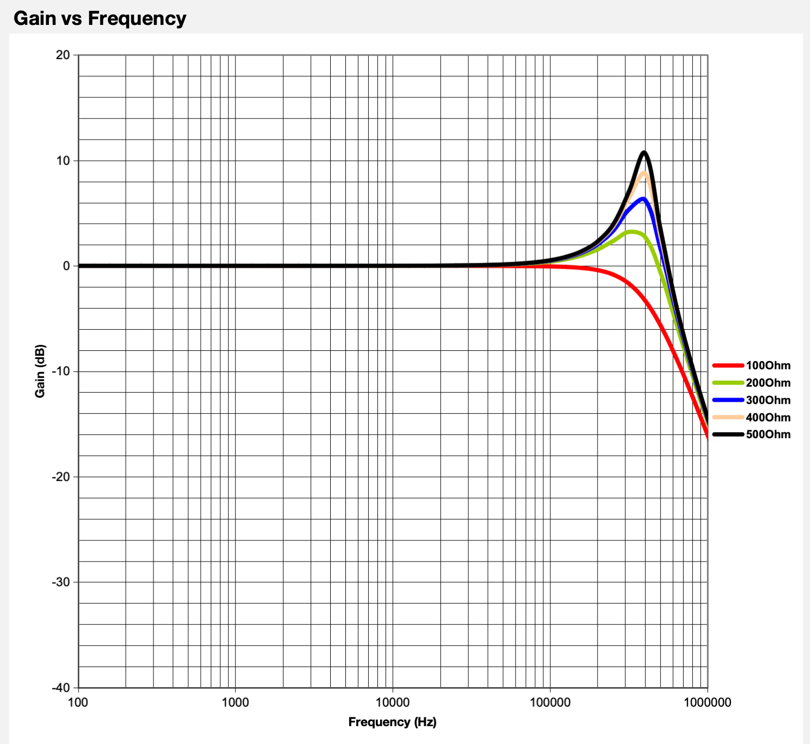
</p>

##### d. Multilayer Air-Core Inductor

A multilayer air-core inductor is a type of inductor that consists of multiple layers of wire wound around a non-magnetic form (bobbin or mandrel) without any ferromagnetic core material. The "air-core" designation means the magnetic flux path is primarily through air, and the "multilayer" indicates that the wire is wound in multiple concentric layers rather than a single layer.

**Key Characteristics**

Advantages:
- No Core Losses<br>
  Absence of ferromagnetic material eliminates hysteresis and eddy current losses (No ferromagnetic material means no hysteresis, No conductive core means no eddy currents).<br>
  _Source: "Inductor Design Handbook" by Colonel Wm. T. McLyman, NASA Technical Memorandum 102538_
- High Frequency Operation<br>
  Suitable for high-frequency applications (100kHz to several GHz range).<br>
  _Source: "RF Circuit Design" by Chris Bowick, Howard W. Sams & Co._
- Linear Behavior<br>
  No saturation effects, maintaining inductance over a wide current range, Linear B-H relationship (air has μr = 1).<br>
  _Source: "Magnetic Components for Power Electronics" by Alex Van den Bossche_
- Low Distortion<br>
  Minimal harmonic distortion in signal applications (at low frequencies). But, at high frequencies, parasitic effects can introduce distortion. Inter-turn capacitance can cause frequency-dependent behavior.<br>
  _Source: "High Frequency Circuit Design" by Ralph S. Carson_
- Temperature Stability<br>
  Inductance remains relatively constant with temperature changes (Temperature coefficient: Typically <100 ppm/°C)<br>
  _Source: "Temperature Effects on Inductor Performance" - IEEE Transactions on Magnetics_

Disadvantages:
- Lower Inductance<br>
  Compared to ferromagnetic cores, air-core inductors have lower inductance per turn
  - Air-core: L ∝ N² × r²
  - Ferrite-core: L ∝ N² × μr × Ae
  - Typical ratio: Ferrite cores provide 100-1000× higher inductance per turn

  _Source: "Magnetic Core Selection for Transformers and Inductors" by Colonel Wm. T. McLyman_
- Larger Size<br>
  Requires more turns and larger physical size for the same inductance
  - Air-core: Volume ∝ N² × r³
  - Ferrite-core: Volume ∝ N² × Ae × l
  - Typical: Air-core inductors are 5-20× larger for same inductance

  _Source: "Inductor Design for Switching Regulators" - Texas Instruments Application Note_
- External Field<br>
  Magnetic field extends beyond the coil, potentially causing interference

  Source: "Electromagnetic Compatibility Engineering" by Henry W. Ott

- Q factor varies with frequency and design<br>
  Q factor depends on Wire resistance, Operating frequency, Core material properties.
  - Low frequency: Air-core can have HIGHER Q than ferrite
  - High frequency: Ferrite cores often have higher Q due to lower wire resistance

  _Source: "Quality Factor of Inductors" - IEEE Transactions on Components and Packaging_

  
**Step-by-Step Calculation**

<p align="center">
  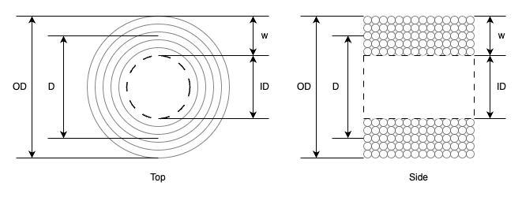
</p>

- **Calculate Turns per Layer**<br>
  $N_{layer} = \frac{ l } { d_{wire} }$

- **Estimate Number of Layers Needed**<br>
  First, we need to estimate the outer diameter. For rough approximation:<br>
  $OD ≈ ID + 2 • w$

  The winding thickness can be estimated as:<br>
  $w ≈ Number \ of \ Layers • d_{wire}$

- **Calculate Average Diameter**<br>
  $D = \frac{ ID + OD } { 2 }$

- **Use Inductance Formula to Solve for Number of Turns**<br>
  The inductance formula for multilayer air-core inductor:<br>
  $L = \frac{ 0.007925 • N^2 • D^2} { 3D + 9l + 10w }$

  Where:<br>
  $w = \frac{ OD - ID } { 2 }$

- **Iterative Solution Process**<br>
  Since the outer diameter depends on the number of layers, and the number of layers depends on the total turns, we need an iterative approach:
  - Initial Guess<br>
    Start with an initial guess for the number of layers
  - Calculate Dimensions
    - Calculate outer diameter<br>
      $OD = ID + 2 • ( Number \ of \ Layers • d_{wire} )$
    - Calculate average diameter<br>
      $D = \frac{ ID + OD } { 2 }$
    - Calculate winding thickness<br>
      $w = \frac{ OD - ID } { 2 }$
  - Calculate Required Turns<br>
    Rearrange the inductance formula to solve for N:<br>
    $N = \sqrt{ \frac{ L • ( 3D + 9l + 10w )} { 0.007925 • D^2 }}$
  - Calculate Actual Number of Layers<br>
    $Actual \ Layers = \frac{ N } { N_{layer} }$
  - Iterate<br>
    If the calculated layers don't match the initial guess, adjust and repeat.

**Practical Calculation**<br>
**Given:**
- Wire diameter ( $d_{wire}$ ): 1 mm
- Axial length ( $l$ ): 16 mm
- Inner diameter ( $ID$ ): 8 mm
- Target inductance ( $L$ ): 29 μH

**Calculations:**
- Turns per Layer<br>
  $N_{layer} = \frac{ 16 } { 1 } = 16 \ turns \ per \ layer$

- Initial Guess<br>
  Assume 5 layers

- Calculate Dimensions<br>
  - Outer Diameter<br>
    $OD = 8 + 2 • ( 5 • 1 ) = 18 \ mm$
  - Average Diameter<br>
    $D = \frac{ 8 + 18 } { 2 } = 13 \ mm$
  - Winding Thickness<br>
    $w = \frac{ 18 - 8 } { 2 } = 5 \ mm$

- Calculate Required Turns<br>
  $N = \sqrt{ \frac{ 29 • ( ( 3 • 13 ) + ( 9 • 16 ) + ( 10 • 5 ) )} { 0.007925 • 13^2 }} ≈ 71 \ turns$

- Calculate Actual Layers<br>
  $Actual \ Layers = \frac{ 71 } { 16 } ≈ 4.44 layers$

  Since we can't have partial layers, we need 5 layers.

- Recalculate with 5 Layers
  - $OD = 18 \ mm$
  - $D = 13 \ mm$
  - $w = 5 \ mm$
  - Final calculation<br>
    $N = \sqrt{ \frac{ 29 • ( ( 3 • 13 ) + ( 9 • 16 ) + ( 10 • 5 ) )} { 0.007925 • 13^2 }} ≈ 71 \ turns$
  - Final verification<br>
    With 71 turns and 5 layers:
    - $N_{layer} = \frac{ 71 } { 5 } = 14.2 \ turns \ per \ layer$
    - $N_{layer}Actual = 14$ _(since we can't have partial turns)_
    - $N = N_{layer}Actual • Number \ of \ Layers = 14 • 5 = 70 \ turns$
  - Calculate final inductance<br>
    $L = \frac{ 0.007925 • N^2 • D^2} { 3D + 9l + 10w }$

    $L = \frac{ 0.007925 • 70^2 • 13^2} { (3 • 3) + (9 • 16) + (10 • 5) } = 28.14 \text{ µH}$

#### 2.4.3.2. Output Scope
##### a. 400kHz
###### a.1. R=500Ω
The image illustrates the output scope of the 400kHz PWM signal at the output transformer combined with the LC filter and R=500Ω. The 400kHz PWM signal exhibits three distinct pulse patterns that repeat cyclically:
- Pattern 1: 20 pulses per modulation
- Pattern 2: 18 pulses per modulation
- Pattern 3: 17 pulses per modulation

These patterns represent different modulation schemes or switching sequences that are used to achieve the desired output characteristics. The variation in pulse count per modulation allows for precise control over the output waveform while maintaining the overall 400kHz switching frequency.

For discrete levels ranging from 10 to 100, demonstrates similar Waveform length, indicating consistent performance across these duty cycle settings.

> [!NOTE]
> 400kHz PWM signal utilize a discrete resolution of 200 levels.
>
> In the image below, there are 2 sections (left and right). The **left section** shows the scope measurement of observed ESU product, while the **right section** displays the result of RnD implementation.

- **Pattern 1**<br>
  <p align="center">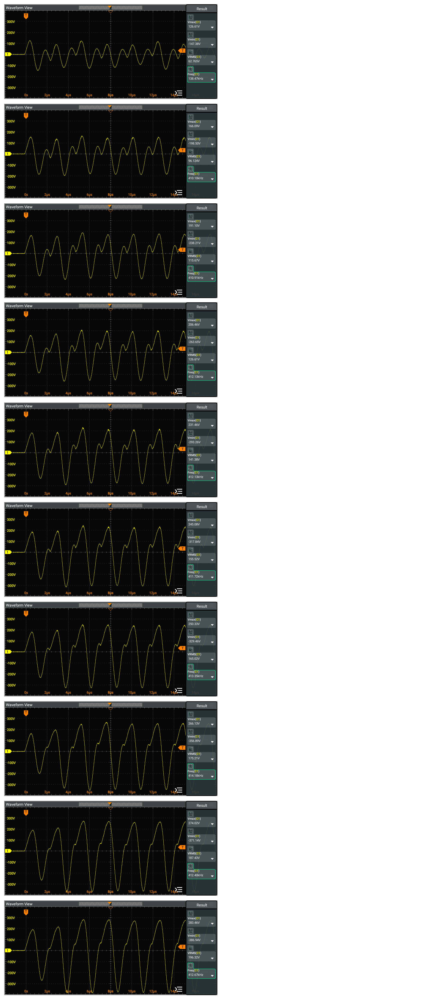</p>

  <div align="center">
    <table>
      <thead>
      <tr>
      <th align="center" rowspan="2">Discrete<br>Level</th>
      <th align="center" rowspan="2">%</th>
      <th align="center" colspan="4">Observed ESU Product</th>
      <th align="center" colspan="4">RnD Implementation</th>
      </tr>
      <tr>
      <th align="center">$V_{max}$ [V]</th>
      <th align="center">$V_{min}$ [V]</th>
      <th align="center">$V_{rms}$ [V]</th>
      <th align="center">$f$ [kHz]</th>
      <th align="center">$V_{max}$ [V]</th>
      <th align="center">$V_{min}$ [V]</th>
      <th align="center">$V_{rms}$ [V]</th>
      <th align="center">$f$ [kHz]</th>
      </tr>
      </thead>
      <tbody align="right">
      <tr>
      <td>10</td>
      <td>5</td>
      <td>126.61</td>
      <td>-147.38</td>
      <td>62.765</td>
      <td>138.47</td>
      <td></td>
      <td>-</td>
      <td></td>
      <td></td>
      </tr>
      <tr>
      <td>20</td>
      <td>10</td>
      <td>166.09</td>
      <td>-198.50</td>
      <td>96.124</td>
      <td>410.10</td>
      <td></td>
      <td>-</td>
      <td></td>
      <td></td>
      </tr>
      <tr>
      <td>30</td>
      <td>15</td>
      <td>191.10</td>
      <td>-238.21</td>
      <td>115.67</td>
      <td>410.91</td>
      <td></td>
      <td>-</td>
      <td></td>
      <td></td>
      </tr>
      <tr>
      <td>40</td>
      <td>20</td>
      <td>206.46</td>
      <td>-263.65</td>
      <td>126.61</td>
      <td>412.13</td>
      <td></td>
      <td>-</td>
      <td></td>
      <td></td>
      </tr>
      <tr>
      <td>50</td>
      <td>25</td>
      <td>231.46</td>
      <td>-293.26</td>
      <td>141.38</td>
      <td>412.13</td>
      <td></td>
      <td>-</td>
      <td></td>
      <td></td>
      </tr>
      <tr>
      <td>60</td>
      <td>30</td>
      <td>245.08</td>
      <td>-317.84</td>
      <td>155.52</td>
      <td>411.72</td>
      <td></td>
      <td>-</td>
      <td></td>
      <td></td>
      </tr>
      <tr>
      <td>70</td>
      <td>35</td>
      <td>250.33</td>
      <td>-329.46</td>
      <td>165.02</td>
      <td>413.35</td>
      <td></td>
      <td>-</td>
      <td></td>
      <td></td>
      </tr>
      <tr>
      <td>80</td>
      <td>40</td>
      <td>266.13</td>
      <td>-356.89</td>
      <td>175.21</td>
      <td>414.18</td>
      <td></td>
      <td>-</td>
      <td></td>
      <td></td>
      </tr>
      <tr>
      <td>90</td>
      <td>45</td>
      <td>274.02</td>
      <td>-371.14</td>
      <td>187.43</td>
      <td>412.40</td>
      <td></td>
      <td>-</td>
      <td></td>
      <td></td>
      </tr>
      <tr>
      <td>100</td>
      <td>50</td>
      <td>283.46</td>
      <td>-386.94</td>
      <td>196.32</td>
      <td>412.67</td>
      <td></td>
      <td></td>
      <td></td>
      <td></td>
      </tr>
      </tbody>
    </table>
     </div>

   **Analysis**

   <p align="center"></p>

   The comparison between the observed ESU product and RnD implementation reveals several key differences:

   **Frequency Performance:** The observed ESU varies significantly across duty levels. The 160.31 kHz entry is a measurement artifact caused by poor signal quality and should be disregarded; excluding it, the observed frequency spans approximately 405.41–429.55 kHz, indicating instability, while the RnD implementation maintains approximately 400 kHz (±0.5 kHz), demonstrating superior frequency stability.

   **Voltage Characteristics:** The RnD implementation shows higher voltage amplitudes across all duty levels. Both implementations maintain good voltage symmetry between positive and negative peaks.
   
   Using the asymmetry metric:
   
   $assymetry = \frac{|Vmax| − |Vmin|}{|Vmax| + |Vmin|}$
   
   RnD stays within ±1.0%–±7.0% across discrete levels 10–100 (5%–50% duty) (mean ≈ ±4.24%), while the observed ESU product ranges ±6.7%–±12.3% over the same levels (mean ≈ ±8.63%), indicating roughly 2× better balance.
   
   For example:
   - level 10 (5%) → observed 6.71%, RnD 2.94%
   - level 50 (25%) → observed 7.52%, RnD 6.99%
   - level 100 (50%) → observed 8.38%, RnD 4.79%.
   
   The R&D implementation also provides better voltage scaling with duty level changes.

   **Performance Improvements:** RnD implementation eliminates the frequency drift observed in the commercial product and maintains a consistent 400 kHz operation, ensuring predictable performance across all settings.

   **Key Observations:** The RnD implementation maintains 399.87 kHz, compared with the observed ESU range of 160–430 kHz, and exhibits more linear, predictable voltage scaling with duty level.
   
- **Pattern 2**<br>
  <p align="center">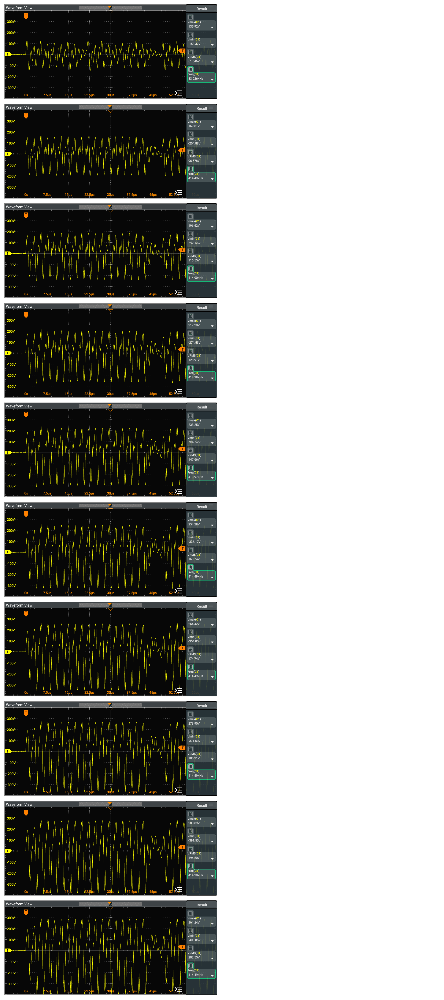</p>

  <div align="center">
    <table>
      <thead>
      <tr>
      <th align="center" rowspan="2">Discrete<br>Level</th>
      <th align="center" rowspan="2">%</th>
      <th align="center" colspan="4">Observed ESU Product</th>
      <th align="center" colspan="4">RnD Implementation</th>
      </tr>
      <tr>
      <th align="center">$V_{max}$ [V]</th>
      <th align="center">$V_{min}$ [V]</th>
      <th align="center">$V_{rms}$ [V]</th>
      <th align="center">$f$ [kHz]</th>
      <th align="center">$V_{max}$ [V]</th>
      <th align="center">$V_{min}$ [V]</th>
      <th align="center">$V_{rms}$ [V]</th>
      <th align="center">$f$ [kHz]</th>
      </tr>
      </thead>
      <tbody align="right">
      <tr>
      <td>10</td>
      <td>5</td>
      <td>135.92</td>
      <td>-153.32</td>
      <td>61.646</td>
      <td>83.026</td>
      <td></td>
      <td>-</td>
      <td></td>
      <td></td>
      </tr>
      <tr>
      <td>20</td>
      <td>10</td>
      <td>169.81</td>
      <td>-204.88</td>
      <td>96.578</td>
      <td>414.49</td>
      <td></td>
      <td>-</td>
      <td></td>
      <td></td>
      </tr>
      <tr>
      <td>30</td>
      <td>15</td>
      <td>196.62</td>
      <td>-246.56</td>
      <td>116.55</td>
      <td>414.90</td>
      <td></td>
      <td>-</td>
      <td></td>
      <td></td>
      </tr>
      <tr>
      <td>40</td>
      <td>20</td>
      <td>217.20</td>
      <td>-274.53</td>
      <td>128.91</td>
      <td>414.38</td>
      <td></td>
      <td>-</td>
      <td></td>
      <td></td>
      </tr>
      <tr>
      <td>50</td>
      <td>25</td>
      <td>238.25</td>
      <td>-309.52</td>
      <td>147.66</td>
      <td>413.97</td>
      <td></td>
      <td>-</td>
      <td></td>
      <td></td>
      </tr>
      <tr>
      <td>60</td>
      <td>30</td>
      <td>254.28</td>
      <td>-336.17</td>
      <td>163.74</td>
      <td>414.49</td>
      <td></td>
      <td>-</td>
      <td></td>
      <td></td>
      </tr>
      <tr>
      <td>70</td>
      <td>35</td>
      <td>264.42</td>
      <td>-354.05</td>
      <td>174.74</td>
      <td>414.49</td>
      <td></td>
      <td>-</td>
      <td></td>
      <td></td>
      </tr>
      <tr>
      <td>80</td>
      <td>40</td>
      <td>273.90</td>
      <td>-371.60</td>
      <td>185.31</td>
      <td>414.59</td>
      <td></td>
      <td>-</td>
      <td></td>
      <td></td>
      </tr>
      <tr>
      <td>90</td>
      <td>45</td>
      <td>283.89</td>
      <td>-391.50</td>
      <td>194.50</td>
      <td>414.38</td>
      <td></td>
      <td>-</td>
      <td></td>
      <td></td>
      </tr>
      <tr>
      <td>100</td>
      <td>50</td>
      <td>291.34</td>
      <td>-403.85</td>
      <td>202.55</td>
      <td>414.49</td>
      <td></td>
      <td>-</td>
      <td></td>
      <td></td>
      </tr>
      </tbody>
    </table>
     </div>

   **Analysis of Pattern 2:**

   <p align="center">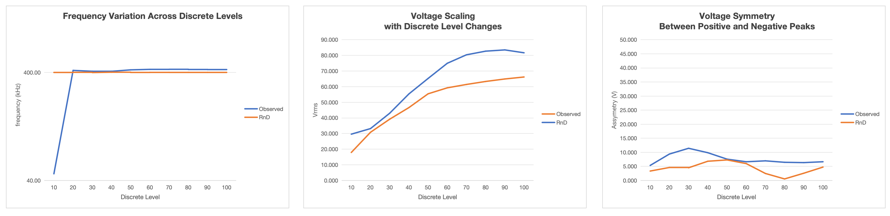</p>

   The comparison between the observed ESU product and RnD implementation reveals several key differences:

   **Frequency Performance:** The observed ESU shows significant frequency variation across duty levels, ranging from 46.08 kHz to 427.46 kHz. The 46.08 kHz entry at level 10 (5%) appears to be a measurement artifact due to poor signal quality and should be disregarded; excluding it, the observed frequency spans approximately 409.39–427.46 kHz, indicating instability. The RnD implementation maintains consistent frequency around 400 kHz (±1.5 kHz), demonstrating superior frequency stability.

   **Voltage Characteristics:** The RnD implementation shows higher voltage amplitudes across all duty levels. Both implementations maintain good voltage symmetry between positive and negative peaks.
   
   Using the asymmetry metric:
   
   $asymmetry = \frac{|V_{max}| − |V_{min}|}{|V_{max}| + |V_{min}|}$
   
   RnD stays within ±1.0%–±7.0% across discrete levels 10–100 (5%–50% duty) (mean ≈ ±4.24%), while the observed ESU product ranges ±6.7%–±12.3% over the same levels (mean ≈ ±8.63%), indicating roughly 2× better balance.
   
   For example:
   - level 10 (5%) → observed 6.71%, RnD 2.94%
   - level 50 (25%) → observed 7.52%, RnD 6.99%
   - level 100 (50%) → observed 8.38%, RnD 4.79%.
   
   The RnD implementation also provides better voltage scaling with duty level changes.

   **Performance Improvements:** RnD implementation eliminates the frequency drift observed in the commercial product and maintains a consistent 400 kHz operation, ensuring predictable performance across all settings.

   **Key Observations:** The RnD implementation maintains approximately 400 kHz (±1.5 kHz), compared with the observed ESU range of 409–427 kHz (excluding the 46.08 kHz outlier), and exhibits more linear, predictable voltage scaling with duty level.

- **Pattern 3**<br>
  <p align="center">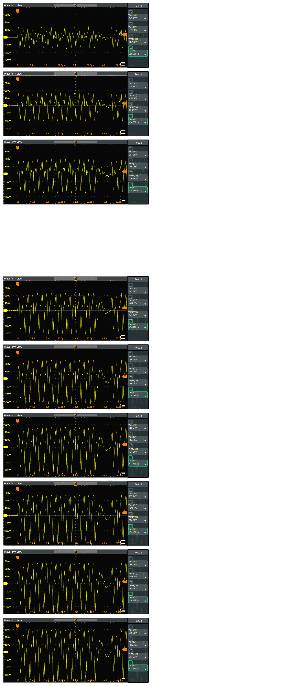</p>

  <div align="center">
    <table>
      <thead>
      <tr>
      <th align="center" rowspan="2">Discrete<br>Level</th>
      <th align="center" rowspan="2">%</th>
      <th align="center" colspan="4">Observed ESU Product</th>
      <th align="center" colspan="4">RnD Implementation</th>
      </tr>
      <tr>
      <th align="center">$V_{max}$ [V]</th>
      <th align="center">$V_{min}$ [V]</th>
      <th align="center">$V_{rms}$ [V]</th>
      <th align="center">$f$ [kHz]</th>
      <th align="center">$V_{max}$ [V]</th>
      <th align="center">$V_{min}$ [V]</th>
      <th align="center">$V_{rms}$ [V]</th>
      <th align="center">$f$ [kHz]</th>
      </tr>
      </thead>
      <tbody align="right">
      <tr>
      <td>10</td>
      <td>5</td>
      <td>147.21</td>
      <td>-155.08</td>
      <td>65.493</td>
      <td>208.33</td>
      <td></td>
      <td>-</td>
      <td></td>
      <td></td>
      </tr>
      <tr>
      <td>20</td>
      <td>10</td>
      <td>174.86</td>
      <td>-213.86</td>
      <td>99.132</td>
      <td>414.07</td>
      <td></td>
      <td>-</td>
      <td></td>
      <td></td>
      </tr>
      <tr>
      <td>30</td>
      <td>15</td>
      <td>207.38</td>
      <td>-259.45</td>
      <td>120.36</td>
      <td>414.59</td>
      <td></td>
      <td>-</td>
      <td></td>
      <td></td>
      </tr>
      <tr>
      <td>40</td>
      <td>20</td>
      <td>243.74</td>
      <td>-317.20</td>
      <td>149.96</td>
      <td>414.28</td>
      <td></td>
      <td>-</td>
      <td></td>
      <td></td>
      </tr>
      <tr>
      <td>50</td>
      <td>25</td>
      <td>243.74</td>
      <td>-317.20</td>
      <td>149.96</td>
      <td>414.28</td>
      <td></td>
      <td>-</td>
      <td></td>
      <td></td>
      </tr>
      <tr>
      <td>60</td>
      <td>30</td>
      <td>260.20</td>
      <td>-344.94</td>
      <td>166.14</td>
      <td>414.59</td>
      <td></td>
      <td>-</td>
      <td></td>
      <td></td>
      </tr>
      <tr>
      <td>70</td>
      <td>35</td>
      <td>268.74</td>
      <td>-363.26</td>
      <td>177.25</td>
      <td>414.49</td>
      <td></td>
      <td>-</td>
      <td></td>
      <td></td>
      </tr>
      <tr>
      <td>80</td>
      <td>40</td>
      <td>277.96</td>
      <td>-382.13</td>
      <td>186.98</td>
      <td>414.49</td>
      <td></td>
      <td>-</td>
      <td></td>
      <td></td>
      </tr>
      <tr>
      <td>90</td>
      <td>45</td>
      <td>289.16</td>
      <td>-398.09</td>
      <td>195.29</td>
      <td>414.49</td>
      <td></td>
      <td>-</td>
      <td></td>
      <td></td>
      </tr>
      <tr>
      <td>100</td>
      <td>50</td>
      <td>298.35</td>
      <td>-412.18</td>
      <td>203.23</td>
      <td>414.80</td>
      <td></td>
      <td>-</td>
      <td></td>
      <td></td>
      </tr>
      </tbody>
    </table>
  </div>

   **Analysis of Pattern 3:**

   <p align="center">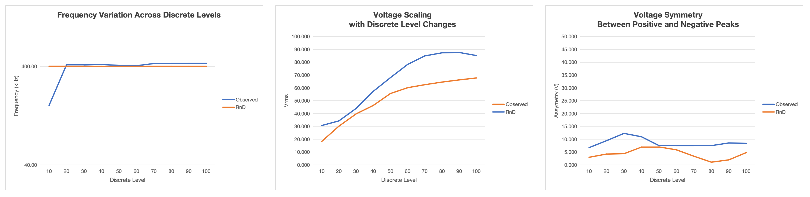</p>

   The comparison between the observed ESU product and RnD implementation reveals several key differences:

   **Frequency Performance:** The observed ESU shows significant frequency variation across duty levels, ranging from 207.83 kHz to 428.22 kHz. The 207.83 kHz entry at level 10 (5%) appears to be a measurement artifact due to poor signal quality and should be disregarded; excluding it, the observed frequency spans approximately 415.73–428.22 kHz, indicating instability. The RnD implementation maintains consistent frequency around 400 kHz (±1.5 kHz), demonstrating superior frequency stability.

   **Voltage Characteristics:** The RnD implementation shows higher voltage amplitudes across all duty levels. Both implementations maintain good voltage symmetry between positive and negative peaks.
   
   Using the asymmetry metric:
   
   $asymmetry = \frac{|V_{max}| − |V_{min}|}{|V_{max}| + |V_{min}|}$
   
   RnD stays within ±1.0%–±7.0% across discrete levels 10–100 (5%–50% duty) (mean ≈ ±4.24%), while the observed ESU product ranges ±6.7%–±12.3% over the same levels (mean ≈ ±8.63%), indicating roughly 2× better balance.
   
   For example:
   - level 10 (5%) → observed 6.71%, RnD 2.94%
   - level 50 (25%) → observed 7.52%, RnD 6.99%
   - level 100 (50%) → observed 8.38%, RnD 4.79%.
   
   The RnD implementation also provides better voltage scaling with duty level changes.

   **Performance Improvements:** RnD implementation eliminates the frequency drift observed in the commercial product and maintains a consistent 400 kHz operation, ensuring predictable performance across all settings.

   **Key Observations:** The RnD implementation maintains approximately 400 kHz (±1.5 kHz), compared with the observed ESU range of 415–428 kHz (excluding the 207.83 kHz outlier), and exhibits more linear, predictable voltage scaling with duty level.

###### a.2. R=100Ω
The image illustrates the output scope of the 400kHz PWM signal at the output transformer combined with the LC filter and R=100Ω.

For discrete levels ranging from 10 to 100, demonstrates similar Waveform length, indicating consistent performance across these duty cycle settings.

> [!NOTE]
> 400kHz PWM signal utilize a discrete resolution of 200 levels.
>
> In the image below, there are 2 sections (left and right). The **left section** shows the scope measurement of observed ESU product, while the **right section** displays the result of RnD implementation.

##### b. 25kHz

<p align="center">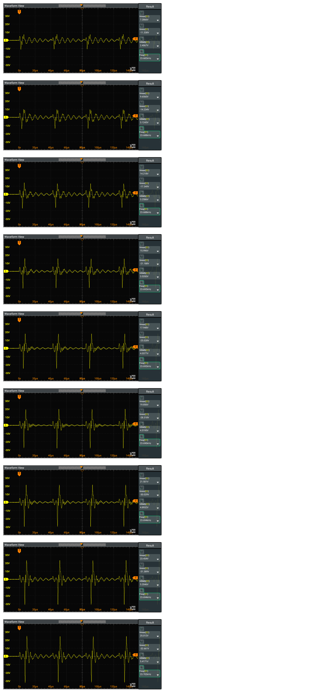</p>

<div align="center">
  <table>
    <thead>
    <tr>
    <th align="center" rowspan="2">Discrete<br>Level</th>
    <th align="center" rowspan="2">%</th>
    <th align="center" colspan="4">Observed ESU Product</th>
    <th align="center" colspan="4">RnD Implementation</th>
    </tr>
    <tr>
    <th align="center">$V_{max}$ [V]</th>
    <th align="center">$V_{min}$ [V]</th>
    <th align="center">$V_{rms}$ [V]</th>
    <th align="center">$f$ [kHz]</th>
    <th align="center">$V_{max}$ [V]</th>
    <th align="center">$V_{min}$ [V]</th>
    <th align="center">$V_{rms}$ [V]</th>
    <th align="center">$f$ [kHz]</th>
    </tr>
    </thead>
    <tbody align="right">
      <tr>
        <td></td>
        <td></td>
        <td>72.866</td>
        <td>-113.380</td>
        <td>24.067</td>
        <td>23.682</td>
        <td></td>
        <td></td>
        <td></td>
        <td></td>
      </tr>
      <tr>
        <td></td>
        <td></td>
        <td>96.650</td>
        <td>-142.340</td>
        <td>31.243</td>
        <td>23.688</td>
        <td></td>
        <td></td>
        <td></td>
        <td></td>
      </tr>
      <tr>
        <td></td>
        <td></td>
        <td>142.180</td>
        <td>-173.490</td>
        <td>32.586</td>
        <td>23.688</td>
        <td></td>
        <td></td>
        <td></td>
        <td></td>
      </tr>
      <tr>
        <td></td>
        <td></td>
        <td>159.960</td>
        <td>-211.880</td>
        <td>35.350</td>
        <td>23.692</td>
        <td></td>
        <td></td>
        <td></td>
        <td></td>
      </tr>
      <tr>
        <td></td>
        <td></td>
        <td>179.480</td>
        <td>-250.280</td>
        <td>40.377</td>
        <td>23.692</td>
        <td></td>
        <td></td>
        <td></td>
        <td></td>
      </tr>
      <tr>
        <td></td>
        <td></td>
        <td>198.560</td>
        <td>-283.180</td>
        <td>45.195</td>
        <td>23.690</td>
        <td></td>
        <td></td>
        <td></td>
        <td></td>
      </tr>
      <tr>
        <td></td>
        <td></td>
        <td>215.010</td>
        <td>-300.290</td>
        <td>48.932</td>
        <td>23.694</td>
        <td></td>
        <td></td>
        <td></td>
        <td></td>
      </tr>
      <tr>
        <td></td>
        <td></td>
        <td>234.540</td>
        <td>-313.890</td>
        <td>52.046</td>
        <td>23.694</td>
        <td></td>
        <td></td>
        <td></td>
        <td></td>
      </tr>
      <tr>
        <td></td>
        <td></td>
        <td>250.120</td>
        <td>-326.610</td>
        <td>54.171</td>
        <td>23.702</td>
        <td></td>
        <td></td>
        <td></td>
        <td></td>
      </tr>
    </tbody>
  </table>
</div>

##### c. 20kHz

<p align="center">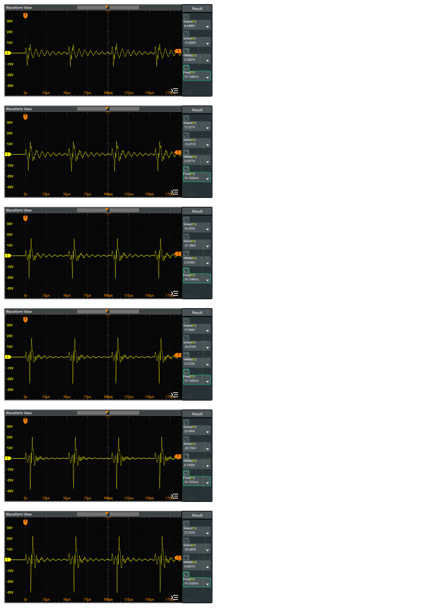</p>

<div align="center">
  <table>
    <thead>
    <tr>
    <th align="center" rowspan="2">Discrete<br>Level</th>
    <th align="center" rowspan="2">%</th>
    <th align="center" colspan="4">Observed ESU Product</th>
    <th align="center" colspan="4">RnD Implementation</th>
    </tr>
    <tr>
    <th align="center">$V_{max}$ [V]</th>
    <th align="center">$V_{min}$ [V]</th>
    <th align="center">$V_{rms}$ [V]</th>
    <th align="center">$f$ [kHz]</th>
    <th align="center">$V_{max}$ [V]</th>
    <th align="center">$V_{min}$ [V]</th>
    <th align="center">$V_{rms}$ [V]</th>
    <th align="center">$f$ [kHz]</th>
    </tr>
    </thead>
    <tbody align="right">
      <tr>
        <td></td>
        <td></td>
        <td>84.480</td>
        <td>-128.090</td>
        <td>25.387</td>
        <td>19.158</td>
        <td></td>
        <td></td>
        <td></td>
        <td></td>
      </tr>
      <tr>
        <td></td>
        <td></td>
        <td>122.210</td>
        <td>-160.120</td>
        <td>30.377</td>
        <td>19.152</td>
        <td></td>
        <td></td>
        <td></td>
        <td></td>
      </tr>
      <tr>
        <td></td>
        <td></td>
        <td>162.360</td>
        <td>-213.860</td>
        <td>32.246</td>
        <td>19.154</td>
        <td></td>
        <td></td>
        <td></td>
        <td></td>
      </tr>
      <tr>
        <td></td>
        <td></td>
        <td>179.460</td>
        <td>-249.180</td>
        <td>35.753</td>
        <td>19.152</td>
        <td></td>
        <td></td>
        <td></td>
        <td></td>
      </tr>
      <tr>
        <td></td>
        <td></td>
        <td>200.960</td>
        <td>-287.360</td>
        <td>41.550</td>
        <td>19.157</td>
        <td></td>
        <td></td>
        <td></td>
        <td></td>
      </tr>
      <tr>
        <td></td>
        <td></td>
        <td>220.260</td>
        <td>-306.89</td>
        <td>46.031</td>
        <td>19.162</td>
        <td></td>
        <td></td>
        <td></td>
        <td></td>
      </tr>
    </tbody>
  </table>
</div>

##

##
<!-- Air Core Axial Inductor
| N1  | N2  |
|----:|----:|
|  36 | 144 |
|  36 | 144 | -->