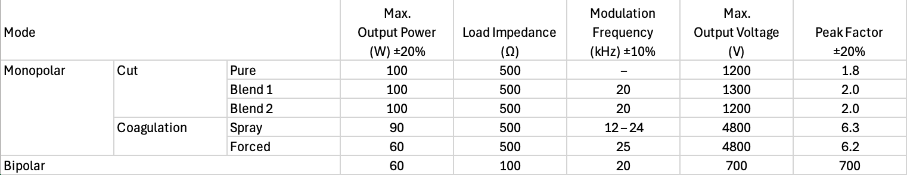

# ESU
Generate RF current

- Monopolar
  - Cut
    - Pure (Unmodulated Sine Wave)
    - Blend 1 (Modulated Sine Wave 1)
      Faster cutting speed
      Small amount bleeding treatment
    - Blend 2 (Modulated Sine Wave 2)
      Slower cutting speed
      Extensive amount bleeding treatment
  - Coagulation
    - Spray
      - Provides surface coagulation with shallow penetration.
      - Facilitates tissue removal.
      - Operates with high output peak voltage.
    - Forced
      - Achieves blood coagulation in a small area.
      - Operates with low output peak voltage.
- Bipolar

Automatically monitor 
- the existence of Return Electrode
- the connection between Generator and Contact area

## Performance Features

- Input voltage is AC220V 50Hz
- Input power 1000VA
- Fuse F6AL250V
- The frequency of each mode is 416kHz ±10%
- The resistance of the contact area must be lower than 150Ω; otherwise, the generator will emit sound and light alert signals.

## Security
### Type I (Class I) electric shock protection
Type I protection represents a fundamental electrical safety classification that provides basic level protection for electrical equipment. It is designed to protect users from macro-shock through a combination of basic insulation and protective earthing, making it suitable for general electrical equipment applications.
- Basic Insulation
  - Primary protective layer
  - Insulates all live electrical parts
  - Prevents direct contact with current-carrying components
- Protective Earth Connection
  - Secondary safety measure
  - Connects exposed conductive parts to ground

Identification
- Marked with earth symbol (⏚)
- Uses yellow/green earth wire
- Standard power connectors

_Complies with IEC 60601-1 for medical devices_

Under normal operating conditions, the basic insulation serves as a barrier that prevents any contact with live electrical parts, ensuring the equipment operates safely. However, if this basic insulation fails, the protective system responds immediately: the fault current is directed through the protective earth connection, which triggers the circuit breaker or fuse to activate, cutting off the power supply before the user can be exposed to dangerous electrical shock.

### CF Applied Part
CF Applied Part represents the highest level of medical device protection, specifically engineered for direct cardiac applications. It is meticulously designed to protect patients from potentially lethal micro-shock during cardiac procedures, making it essential for any equipment that comes into direct contact with the heart.
- Multiple Isolation Barriers
  - Primary isolation through reinforced insulation
  - Secondary isolation via transformer coupling
  - Additional protective layers for enhanced safety
  - Specialized shielding against interference
- Floating Design
  - Electrically isolated from ground and other circuits
  - Independent power supply system
  - Galvanic separation from main power
  - Protected against defibrillator discharge effects
This floating design enables:
- Extremely low leakage current (10µA normal, 50µA fault)
  - Critical for preventing micro-shock to the heart
  - Only possible because of the complete isolation
- Very high isolation voltage (>4000V)
  - Achieved through multiple isolation barriers
  - Necessary to withstand defibrillation pulses
- Defibrillation-proof capability
  - Protected against high-voltage defibrillator discharge
  - Essential for cardiac emergency situations

Under normal operating conditions, the multiple isolation barriers and floating design work together to completely isolate the patient circuit from any electrical sources. The floating design maintains extremely low leakage current (10µA) and high isolation voltage (>4000V), ensuring safe direct cardiac contact. If any fault occurs, the system's independent isolation layers provide redundant protection: even if one barrier fails, the remaining isolation systems maintain patient safety by keeping leakage current below 50µA. Additionally, if a defibrillator discharge occurs during cardiac emergency, the high isolation voltage and floating design protect both the patient and the equipment by absorbing and dispersing the high-voltage pulse without compromising the isolation system.
Think of it like a chain of protection:
```
Floating Design
  → Complete Isolation
    → Low Leakage Current
    → High Isolation Voltage
    → Defibrillation Protection
```

Identification
- Marked with CF symbol (♡)
- Often uses orange color coding
- Specific medical connectors
